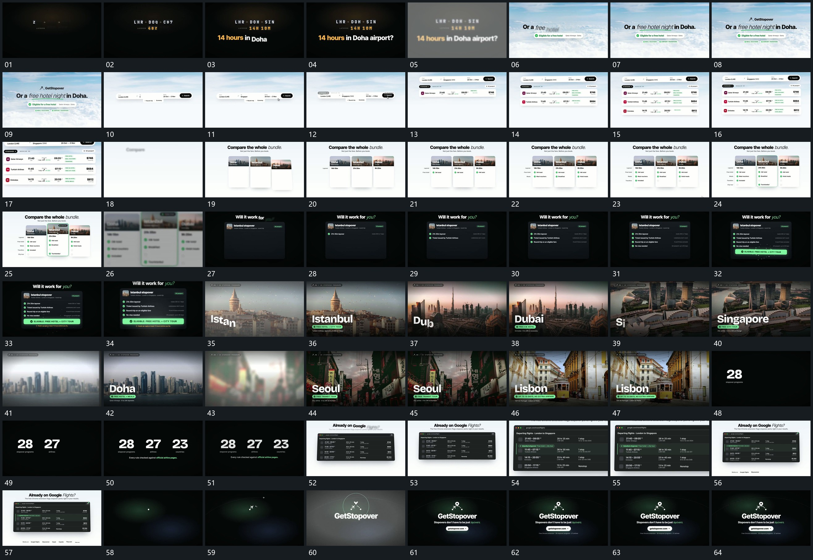

# 021 · 运动过程总览

## 运动总览

开头短字和数值逐项建立，亮闪后新底层接管。[固定长条填字，下方短卡逐行补入](mechanisms/m01.md) 在固定长条里补齐内容，再向下增加横向短卡。[竖卡并置后内部逐行累计，单卡边界突出](mechanisms/m02.md) 收成并置竖卡，内部按行累计，当前项获得边界强调。

随后 [面板内完成点逐行出现，结果长条最后接入](mechanisms/m03.md) 在固定面板内逐行建立完成点与短文，末端结果长条接入。接 [满幅图像模糊接替，底部标题与短标错开建立](mechanisms/m04.md) 用模糊过渡连续更换满幅图像，底部字组和短标分层建立。数值集合在后面逐项接入。

后段 [全框推近局部行，突出一项后缩回](mechanisms/m05.md) 建立固定窗口，推近局部行并突出一项，再缩回完整框。尾部沿弧线移动的小形到达中央后，标记和字组接力完成。

## 完整64宫格

按从左至右、从上至下阅读，覆盖全片首尾。具体运动分镜见各子机制。

## 原片与观察范围

[观看参考视频](video.mp4) · [原始来源](https://skillry.dev/ai-videos/opus-5-5/priyansh0327-206409)

依据真实源帧总览及必要局部序列整理，仅描述可见运动、相对布局与接续。抽帧观察不等于原速连续观看或声音核验；不推定精确曲线、隐藏结构、作者源码或原始生成指令。迁移到新片仍需实现和预览。
