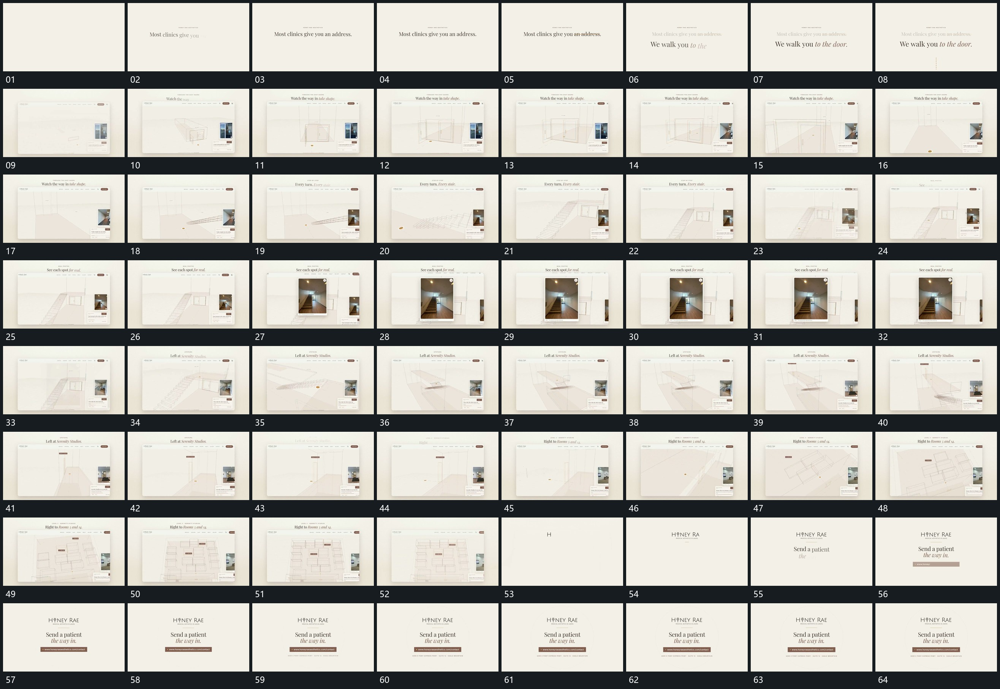

# 028 · 运动过程总览

## 运动总览

开头两行文字先后显出，旧行退弱，新行接续；虚线延长后完整窗口接入。[线段由少到多补成空间轮廓](mechanisms/m01.md) 在窗口内从短线到空间轮廓逐步建立，旁侧小片留作参照。

随后 [内部视角转向并沿纵深靠近，旁层固定](mechanisms/m02.md) 改变内部观察角度并向纵深推进，轮廓范围先在斜向视角中显出，再靠近其内部。中段 [旁侧局部提成大窗，强调后收回](mechanisms/m03.md) 从旁侧小片所在范围提起较大图像窗，强调后收回，原轮廓仍在。

之后 [内部视角转向并沿纵深靠近，旁层固定](mechanisms/m02.md) 再次沿空间路径转向与前进，旁侧内部画面接续更换。后段 [近处范围拉远，更多重复模块显出](mechanisms/m04.md) 从近处拉远，更多重复模块显出，多个局部标记留在原位置。末尾整体退去，中心字组和长条接入。

## 完整64宫格

按从左至右、从上至下阅读，覆盖全片首尾。具体运动分镜见各子机制。

## 原片与观察范围

[观看参考视频](video.mp4) · [原始来源](https://skillry.dev/ai-videos/opus-5-5/pwntastickev-664257)

依据真实源帧总览及必要局部序列整理，仅描述可见运动、相对布局与接续。抽帧观察不等于原速连续观看或声音核验；不推定精确曲线、隐藏结构、作者源码或原始生成指令。迁移到新片仍需实现和预览。
