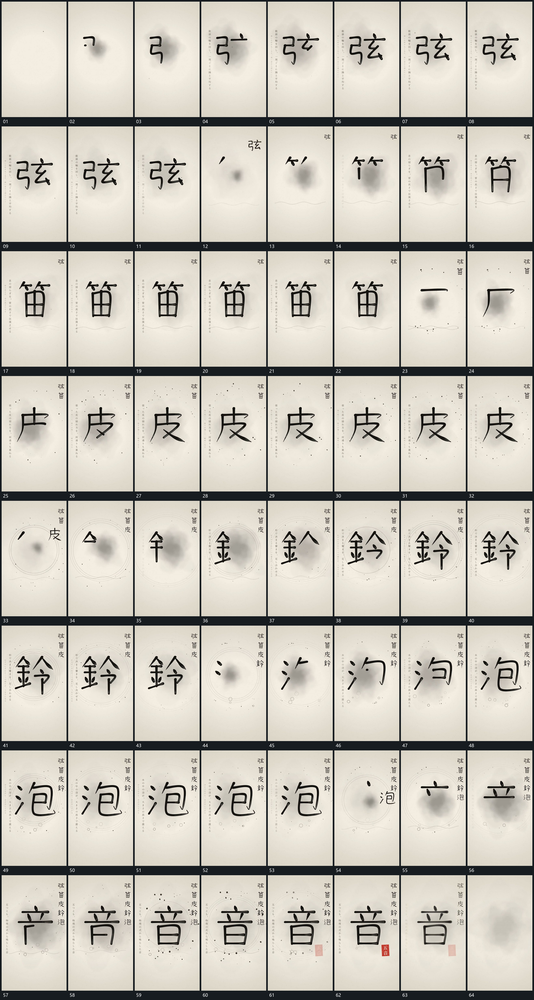

# 081 · 运动过程总览

## 运动总览

全片多次复用[短笔段按路径累积成完整主形](mechanisms/m01.md)，从首段线形依次补成完整主形，再用[完成主形缩小移入侧列中央重新描入](mechanisms/m02.md)把完成主形缩小并移到侧上方，留出中央给下一形。随阶段推进，[下方双曲线相位错开持续起伏](mechanisms/m03.md)在下方建立两条起伏线并持续变化，[同心圈绕中央变化半径散点外围经过](mechanisms/m04.md)补同心圈与外围散点。

后半段[空心小圈从下方分次升入中央周边](mechanisms/m05.md)让空心小圈从下方分次升入，中央主形仍继续复用[短笔段按路径累积成完整主形](mechanisms/m01.md)。最后侧列与中央完整主形共同保持，小标接入后整组退弱；静止阅读不单独增加机制。

## 完整64宫格

按从左至右、从上至下阅读，覆盖全片首尾。具体运动分镜见各子机制。

## 原片与观察范围

[观看参考视频](video.mp4) · [原始来源](https://skillry.dev/ai-videos/opus-5-5/rakhsh-tech-544921)

依据真实源帧总览及必要局部序列整理，仅描述可见运动、相对布局与接续。抽帧观察不等于原速连续观看或声音核验；不推定精确曲线、隐藏结构、作者源码或原始生成指令。迁移到新片仍需实现和预览。
