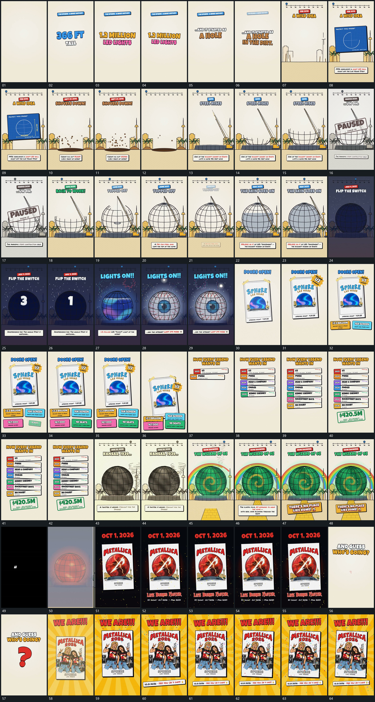

# 059 · 运动过程总览

## 运动总览

开头字组分段建立，顶端长轴接入。[点沿固定长轴推进，旁侧短标原位接替](mechanisms/m01.md) 让点沿长轴推进，旁侧短标在原位更新，这一动作贯穿中段。[固定片内圆弧逐段补齐，交叉曲线与边缘标记后到](mechanisms/m02.md) 在固定片内逐段补齐圆弧与交叉曲线，边缘短标随后延长。

中段 [小点上浮退去，轮廓由下向上补齐，末端部件封合](mechanisms/m03.md) 从基线旁的小点上浮开始，再从下到上补出大轮廓，末端部件最后封合。局部大斜片短暂盖在轮廓前，退出后继续建立。[大数值递减，终点后内面逐段填入并追加扩散小点](mechanisms/m04.md) 在较暗内态中递减大数值，终点后内面逐段填入，外围短点扩散。[大竖片前层接入，附属短片错峰增加，整组缩小侧移](mechanisms/m05.md) 接入前层大竖片，四周短片错峰补齐，整体缩小侧移；[短横片从上到下累计成纵列，底部大反馈片最后加入](mechanisms/m06.md) 从上到下增加短横片纵列，底部大反馈片最后接入。

后段轮廓内状态持续替换，旁侧弧线绕行，前层短片接替。末尾大竖片重复 [大竖片前层接入，附属短片错峰增加，整组缩小侧移](mechanisms/m05.md) 的入场与附属增加，后层放射形建立，外围散片经过，最后保持。

## 完整64宫格

按从左至右、从上至下阅读，覆盖全片首尾。具体运动分镜见各子机制。

## 原片与观察范围

[观看参考视频](video.mp4) · [原始来源](https://skillry.dev/ai-videos/opus-5-5/retropunkai-277590)

依据真实源帧总览及必要局部序列整理，仅描述可见运动、相对布局与接续。抽帧观察不等于原速连续观看或声音核验；不推定精确曲线、隐藏结构、作者源码或原始生成指令。迁移到新片仍需实现和预览。
