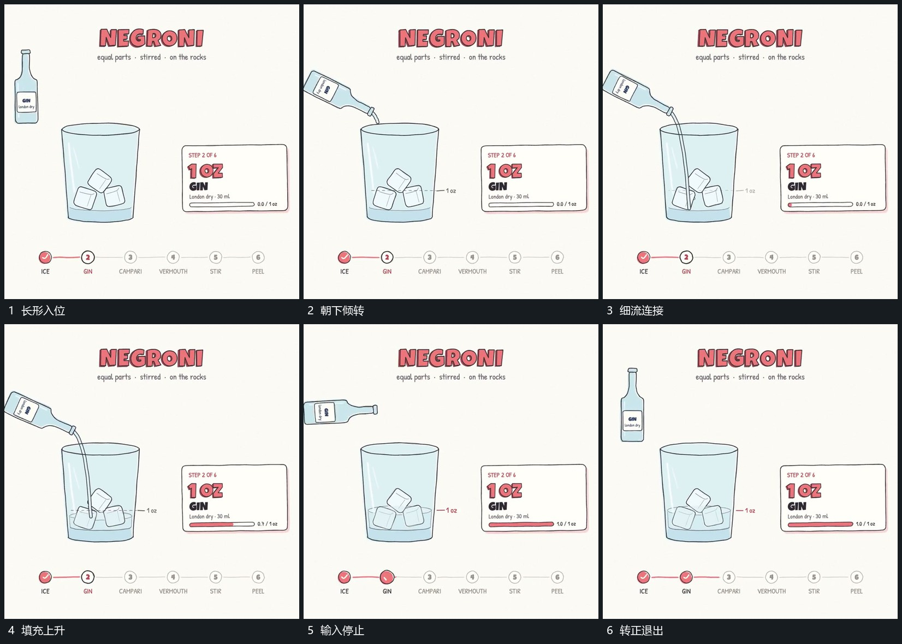

# 上方长形倾转，细流连接后内部填充升高

## 运动指令

让长形从上方进入，转动到端部朝向下方承接区，再建立连接两者的细流。细流持续时，下方内部填充逐渐升高，已有小块与先前填充保留；达到这一轮终点后先停止细流，再让上方长形转正、向上退出。后续换一个输入形仍从已增加的高度继续。

## 分镜过程

## 组合与调整

可以替换输入形和承接边界，核心是输入期间累计、退出后结果保留。原片重复多轮同一关系，复用此机制即可，不按每轮另建卡。
