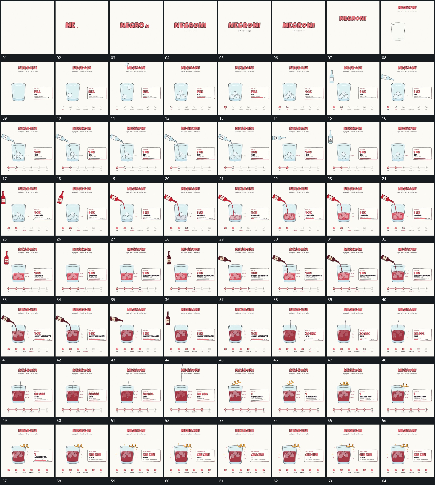

# 060 · 运动过程总览

## 运动总览

开头 [主字逐个放大落位，再上移让出下方轮廓](mechanisms/m01.md) 让文字逐字落位，再缩小上移，描出下方轮廓并建立侧方说明与底部节点。[小块分批下降旋转，先到的在下方累积](mechanisms/m02.md) 分批落入旋转小块，内部累积，进度与完成节点响应。

每轮操作之间复用 [说明区域换内容，连接线向下一节点延长](mechanisms/m03.md)：主区域不清空，只更换侧方说明并把连线接到下一节点。随后 [上方长形倾转，细流连接后内部填充升高](mechanisms/m04.md) 让上方长形倾转、建立细流、内部填充升高，再停流、转正、退出。这段在中部多次重复，输入形更换，但下方沿用前一轮的结果继续增长。

之后 [细杆向下插入，围绕下端摆动后抽出](mechanisms/m05.md) 将细杆插入，围绕下端往复摆动再抽出。[上方短形先摆动，再横移到边缘落位](mechanisms/m06.md) 让上方短形先局部动作，再横移到边缘落位。末段 [外围短线闪现，侧卡换成完成状态](mechanisms/m07.md) 给出短促外围反馈，侧卡更新，整组保留完成状态收尾。

## 完整64宫格

按从左至右、从上至下阅读，覆盖开头到结尾；用于查看全片发展，具体机制已在各自文档中配分镜。

## 原片与观察范围

[观看参考视频](video.mp4) · [原始来源](https://skillry.dev/ai-videos/opus-5-5/ror-fly-880547)

本次依据真实源帧的完整总览、密集序列及必要局部补帧整理，仅记录可见运动与接续。抽帧观察不等于原速连续观看或声音核验；不据此指定精确曲线、隐藏结构、作者源码或原始生成指令。机制可迁移，具体实现仍需在新片中预览检验。
