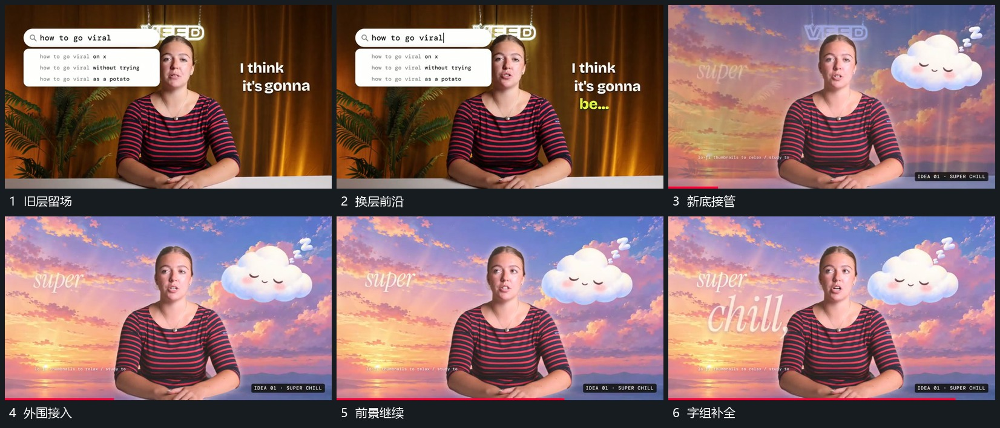

# 活动前景留场，后层替换后再补外围元素

## 运动指令

保留中部活动轮廓，让后层逐渐被新的画面替换。换层过程中前景仍持续动作，不跟随背景整体退出；新底层可辨认后，外围小块和大小字组分批接入。后续再次换层时沿用这种前景作参照的关系，也可在外张动作形成明显姿态时直接切换底层。

## 分镜过程

## 组合与调整

可调整后层的替换方式与周边数量。保持的是前景的观看位置和动作接续，不要求每次姿态相同；若源动作无法衔接，应另设计遮挡，不声称天然连续。
