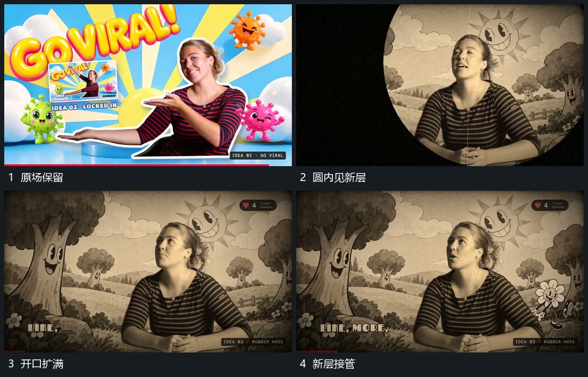

# 中心圆形开口扩大，内部画面接管全屏

## 运动指令

在旧画面中央打开圆形区域，让新层先从圆内露出。继续扩大圆的可见范围，使新层向四周接管，直到圆边越出整个画面。完成后保留新层，外围附加元素再陆续建立，不在圆边尚未离场时同时堆入全部信息。

## 分镜过程

## 组合与调整

开口中心可改到前一机制留下的焦点。需分别决定内层是否缩放；本机制核心是可见范围扩大，不能只把一个不透明圆放大盖住旧层。
