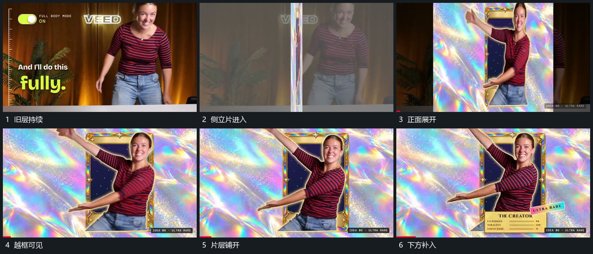

# 侧立片层翻开，前景轮廓越出框边

## 运动指令

让新片层以近乎侧立的窄面进入，随后转向正面并铺开。片层内部的框先成为新的空间参照，活动轮廓位于框前，局部越出边缘；旧底层在翻开期间退去。正面稳定后，再接入框下附属区域，保持前景、内框、底层的遮挡顺序。

## 分镜过程

## 组合与调整

可改变翻转方向和片面宽度，必须保留窄侧面到正面的过渡及越框关系。源帧只支持可见翻开，不指定隐藏面的结构或精确旋转曲线。
