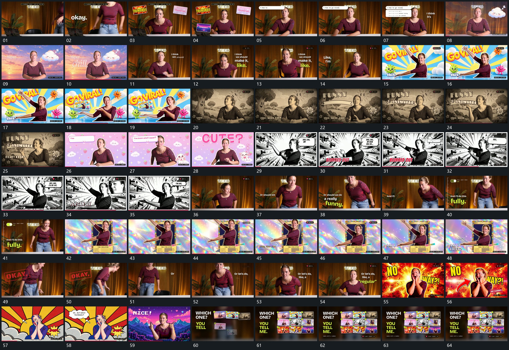

# 001 · 运动过程总览

## 运动总览

开头中心活动层保持，[外围小片错开进入，中心活动层持续保留](mechanisms/m01.md) 在外围逐片补入，接 [长条内逐字累积，再向下展开多行](mechanisms/m02.md) 展开旁侧内容。随后多次复用 [活动前景留场，后层替换后再补外围元素](mechanisms/m03.md)：前景动作继续，后层更换，旁侧字组与小片重新建立。中间一次外张动作把观看方向引到侧方，以 [前景动作让出空位，小片随后落入](mechanisms/m04.md) 在空位接住新增小片。

之后 [中心圆形开口扩大，内部画面接管全屏](mechanisms/m05.md) 将圆内的新层扩成全屏，附属长条与字组接力出现。换入下一底层后，[固定气泡内文字逐项增多，退场后让出后层](mechanisms/m06.md) 让气泡内部累积并退场，后层大字接上；再由 [原活动层继续，角落另开局部放大窗](mechanisms/m07.md) 在角落展示局部，原活动层始终保留。后层继续更换与回切，文字分组接入在这些段落重复使用。

后段以 [侧立片层翻开，前景轮廓越出框边](mechanisms/m08.md) 翻开新片并建立越框关系，接 [并列短线从固定起点逐步延长](mechanisms/m09.md) 延长下方短线；一段保持与文字建立后，再用 [倾斜标记先后叠到已有画面，前一个继续保留](mechanisms/m10.md) 追加倾斜标记。这两种动作独立成卡，不要求新片必须连用。

随后回到活动前景与新底层，箭头、圈线、气泡先后建立。末段 [旧画面方块化遮蔽，换底后恢复清楚](mechanisms/m11.md) 先遮蔽换底，接 [小片从下方逐项升入转正，按行填满网格](mechanisms/m12.md) 逐行累积小片成网格，短句与角标补齐后收住。附属字组和线形在多处重复出现，不各自凑成新的机制。

## 完整64宫格

按从左至右、从上至下阅读，覆盖开头到结尾；用于查看全片发展，具体机制已在各自文档中配分镜。

## 原片与观察范围

[观看参考视频](video.mp4) · [原始来源](https://skillry.dev/ai-videos/opus-5-5/sab8a-475686)

本次依据真实源帧的完整总览、密集序列及必要局部补帧整理，仅记录可见运动与接续。抽帧观察不等于原速连续观看或声音核验；不据此指定精确曲线、隐藏结构、作者源码或原始生成指令。机制可迁移，具体实现仍需在新片中预览检验。
