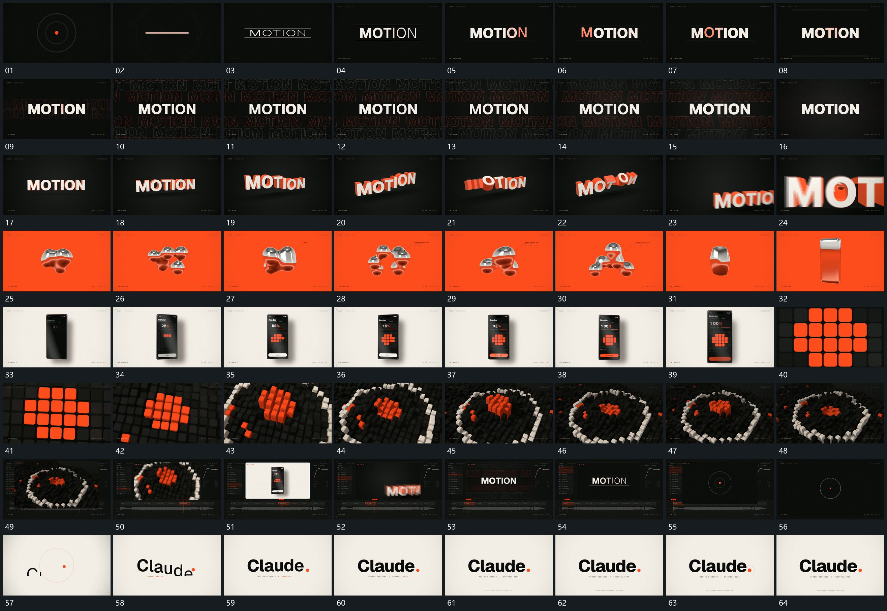

# 036 · 运动过程总览

## 运动总览

开头由点与环转为中央横线，[横线拉开上下边界，字组揭出后逐步扩粗](mechanisms/m01.md) 在两条横线间揭出字组并让字形扩粗。[中央实字保持，后层轮廓字铺满后退净](mechanisms/m02.md) 保留中央实字，后层重复轮廓字从少到多铺满，再退去。[单字错开翻转带出厚度，整组前移放大越界](mechanisms/m03.md) 将字组带出厚度，单字错开翻转，整组放大越界。

中段 [圆块群反复分合，收成竖形后拉长](mechanisms/m04.md) 让圆块群反复分合，最后收成竖形并拉长；新竖框接管。[固定竖框中格子分批填入，数值同步增加后局部放大](mechanisms/m05.md) 在固定竖框内让小格分批填满，同时数值增加，完成后推入局部。[平面网格逐格抬起，退镜中外围接成圆环](mechanisms/m06.md) 把网格小格逐步抬高并退镜，外围小格接成圆环。末段缩回完整布局，内部轮换到起始字组和点环，再建立收尾字组保持。

## 完整64宫格

按从左至右、从上至下阅读，覆盖全片首尾。具体运动分镜见各子机制。

## 原片与观察范围

[观看参考视频](video.mp4) · [原始来源](https://skillry.dev/ai-videos/opus-5-5/sahildesigner23-307120)

依据真实源帧总览及必要局部序列整理，仅描述可见运动、相对布局与接续。抽帧观察不等于原速连续观看或声音核验；不推定精确曲线、隐藏结构、作者源码或原始生成指令。迁移到新片仍需实现和预览。
