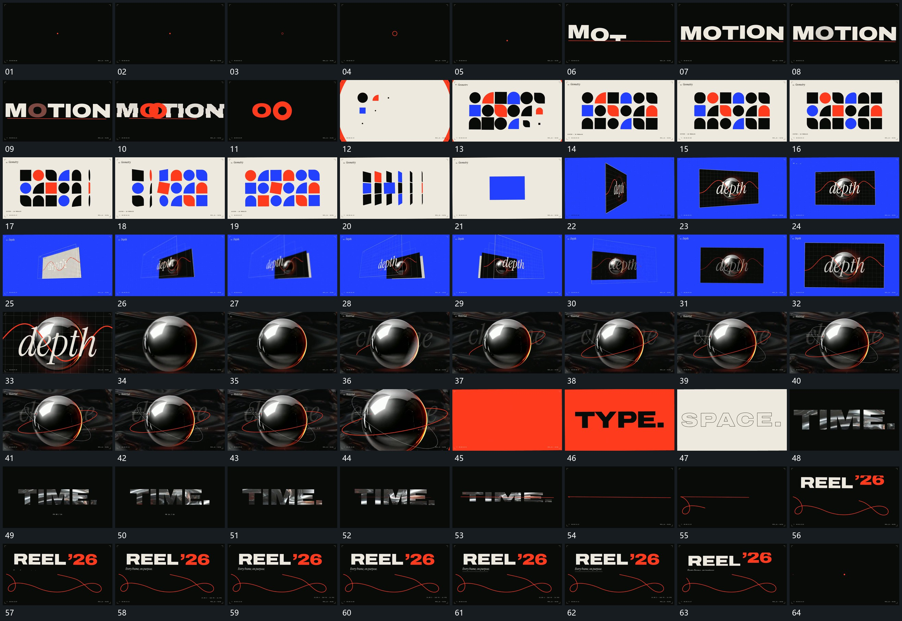

# 116 · 运动过程总览

## 运动总览

全片从小点与圈开始，[主行逐段建立局部圆形留下作为下一接点](mechanisms/m01.md)逐段建立主行并把其中圆形残留作为转场接点。[少量片扩成格阵各片错开转角最后侧立回收](mechanisms/m02.md)从少量片扩成格阵，局部转角与形态接替持续进行。格阵侧立后收为单片，[单片转角后多框沿纵深拉开再合回推近](mechanisms/m03.md)让单片沿纵深拉开多个框，再合回并推近。

随后[球组保持外围倾角环持续转向与绕行](mechanisms/m04.md)让球组与不同倾角环持续转向，主行改用[字形窗口内部图层持续经过外轮廓保持后压成细线](mechanisms/m05.md)的字形窗口承载原内部图层。字行压低成细线后，[细线沿路径延长弯成回环主行随后建立](mechanisms/m06.md)继续沿线延长并弯成回环，上方新主行分段接入，最后保持。

## 完整64宫格

按从左至右、从上至下阅读，覆盖全片首尾。具体运动分镜见各子机制。

## 原片与观察范围

[观看参考视频](video.mp4) · [原始来源](https://skillry.dev/ai-videos/opus-5-5/samuel-spitz-503053)

依据真实源帧总览及必要局部序列整理，仅描述可见运动、相对布局与接续。抽帧观察不等于原速连续观看或声音核验；不推定精确曲线、隐藏结构、作者源码或原始生成指令。迁移到新片仍需实现和预览。
