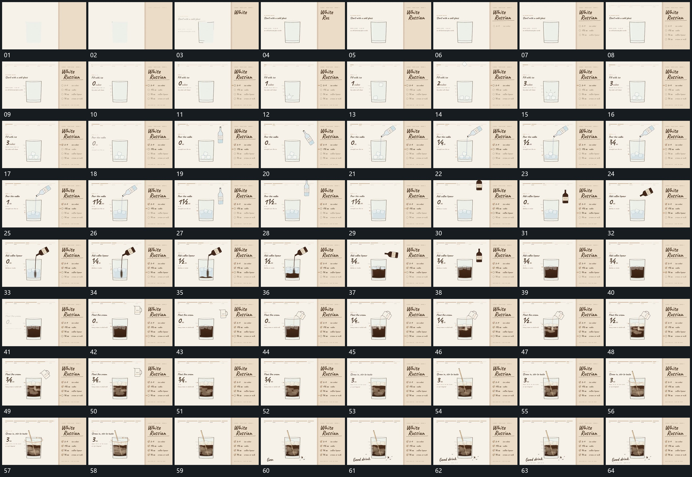

# 075 · 运动过程总览

## 运动总览

全片固定同一外框，用[轮廓先描出再补标题与列表](mechanisms/m01.md)先描出边界，再补标题与多行条目；[小块从上方逐次落入底部并累积](mechanisms/m02.md)让小块从上方逐次落入并累积。之后两次复用[上方小容器倾斜接出细流下区逐步增高](mechanisms/m03.md)，上方小容器进入、倾斜，细流连接到下区，下区增长后容器转正退出。

第三次加入改用[流入的新层从落点展开而已有层保持](mechanisms/m04.md)，新片层从流入位置展开，已有块和区域保持可辨。最后[长杆插入围中心扫动并带动内部曲线](mechanisms/m05.md)让长杆插入、围中心扫动并带动内部曲线，旁侧完成标记接入，下方短字在同一框架下收尾。

## 完整64宫格

按从左至右、从上至下阅读，覆盖全片首尾。具体运动分镜见各子机制。

## 原片与观察范围

[观看参考视频](video.mp4) · [原始来源](https://skillry.dev/ai-videos/opus-5-5/sarut0bisasuke-069973)

依据真实源帧总览及必要局部序列整理，仅描述可见运动、相对布局与接续。抽帧观察不等于原速连续观看或声音核验；不推定精确曲线、隐藏结构、作者源码或原始生成指令。迁移到新片仍需实现和预览。
