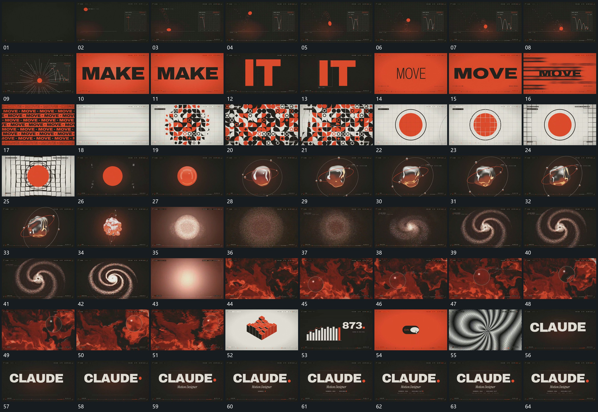

# 114 · 运动过程总览

## 运动总览

全片以[球沿前方连续起落每次落地压扁再恢复](mechanisms/m01.md)的连续起落开场，接到[字行宽厚连续变化后多排字列错开经过](mechanisms/m02.md)在固定基线内的字形宽厚变化与字列接替。之后[中央片组向外补成格阵局部形态逐项转向](mechanisms/m03.md)让多种片面从中央逐步扩展成格阵，局部转角沿格位经过。

中段[软轮廓持续转向外围点沿不同倾角线绕行](mechanisms/m04.md)围中央软轮廓持续转向，外围点沿不同倾角线路绕行。轮廓退去后[点团先扩散再收成平面螺旋并加密圈层](mechanisms/m05.md)把点团收成平面螺旋，圈层逐步加密。接下来[满幅曲面局部卷动小圆窗口侧向经过](mechanisms/m06.md)在满幅曲面起伏中保留小圆窗口的侧向经过。后段短片以清楚换镜接替，静止图面不另拆卡；结尾[主行建立行末点接上附属行依次延长](mechanisms/m07.md)把主行与行末点、附属行依次建立。

## 完整64宫格

按从左至右、从上至下阅读，覆盖全片首尾。具体运动分镜见各子机制。

## 原片与观察范围

[观看参考视频](video.mp4) · [原始来源](https://skillry.dev/ai-videos/opus-5-5/seflless-929329)

依据真实源帧总览及必要局部序列整理，仅描述可见运动、相对布局与接续。抽帧观察不等于原速连续观看或声音核验；不推定精确曲线、隐藏结构、作者源码或原始生成指令。迁移到新片仍需实现和预览。
