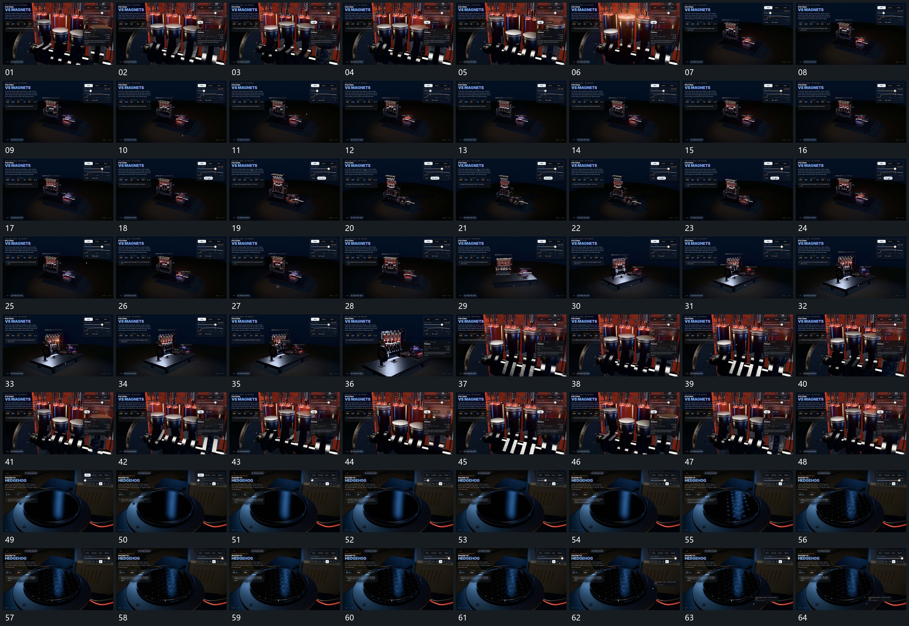

# 102 · 运动过程总览

## 运动总览

全片先以[多个竖杆错峰往复下方连接连续转向](mechanisms/m01.md)让多个竖杆错峰往复，并保持下方连接连续。[退到全貌转角后推入局部持续运动](mechanisms/m02.md)退到全貌、转角再推向局部，竖杆往复始终持续。中间[上层纵向抬离露出下部再原位合回](mechanisms/m03.md)把上层沿纵向抬离，露出下层后再合回。

后段换到一个圆形面，[圆形面细突起从局部到周边逐步增加](mechanisms/m04.md)从局部开始增加细突起，逐渐向周边扩展并保持；其后只作少量观察转角。旁侧短项接替是附属变化，不把原数字与解释写进运动指令。

## 完整64宫格

按从左至右、从上至下阅读，覆盖全片首尾。具体运动分镜见各子机制。

## 原片与观察范围

[观看参考视频](video.mp4) · [原始来源](https://skillry.dev/ai-videos/opus-5-5/stefanostraus-971191)

依据真实源帧总览及必要局部序列整理，仅描述可见运动、相对布局与接续。抽帧观察不等于原速连续观看或声音核验；不推定精确曲线、隐藏结构、作者源码或原始生成指令。迁移到新片仍需实现和预览。
