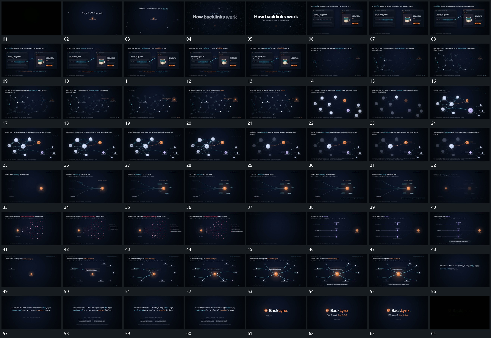

# 053 · 运动过程总览

## 运动总览

开头中央小点与短字建立，更多点进入视野后主字接管。[两片间连线逐步延伸，终点片的局部边界随后建立](mechanisms/m01.md) 在两片间延伸连接线，终点局部边界随后建立。[分散点依次点亮，点间连线累计成网络](mechanisms/m02.md) 将分散点逐步点亮，并在点间追加连接，网络从少到多建立。

中段 [点间局部传递，数值与尺度更新后突出一条分支](mechanisms/m03.md) 让各点沿连接发生局部传递，点内数值更新、尺度变化，最后仅突出一个分支，其余退弱。[多侧曲线汇到中央点，短标签逐项补入](mechanisms/m04.md) 从多侧延伸曲线汇到中央主点，旁侧短标签逐项出现。[密集点群建立中心连接，旁列表逐行追加](mechanisms/m05.md) 建立密集点群与中心连接，旁侧列表分行追加。[多条水平线先建立，中部短竖标加入，再汇向侧端主点](mechanisms/m06.md) 多条水平线先立起，中部短竖标加入，线的侧端再汇向主点。

末段 [外围节点先补圈，曲线逐条关联中央，中心尺度增加](mechanisms/m07.md) 在分散节点周围先补局部圈，再延伸多条曲线关联中央，中央扩大，其余节点仍可见。最后网络退去，字组分行建立，附属短行与底条补齐后退暗。

## 完整64宫格

按从左至右、从上至下阅读，覆盖全片首尾。具体运动分镜见各子机制。

## 原片与观察范围

[观看参考视频](video.mp4) · [原始来源](https://skillry.dev/ai-videos/opus-5-5/stewchan2-369810)

依据真实源帧总览及必要局部序列整理，仅描述可见运动、相对布局与接续。抽帧观察不等于原速连续观看或声音核验；不推定精确曲线、隐藏结构、作者源码或原始生成指令。迁移到新片仍需实现和预览。
