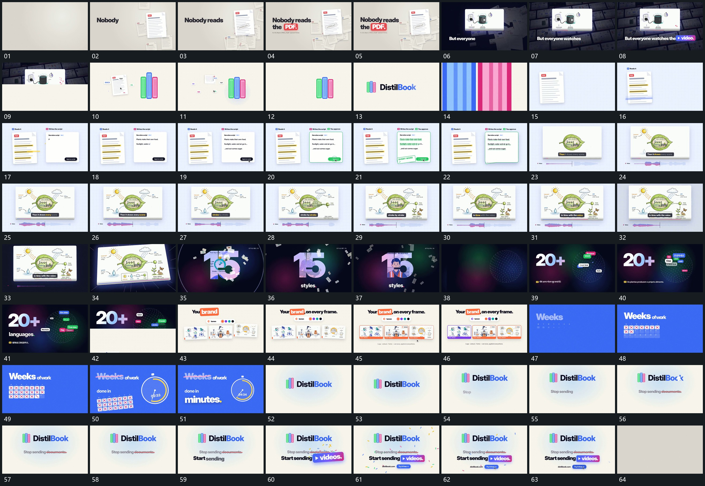

# 061 · 运动过程总览

## 运动总览

开头 [字组分段建立，旁侧大面前提，外围小片错峰叠入](mechanisms/m01.md) 将字组分段建立，旁侧大片前提，外围小片错峰叠入。下一组从小格集合里选出一片到前景。[散开平面汇入中央短形，短形保留后接上主字](mechanisms/m02.md) 将散开平面朝中央短形汇入，短形留住，主字随后接上；竖向长带扩开换底。

中段 [并置两片局部强调增加，后片逐行输入后完成反馈](mechanisms/m03.md) 在两片并置中让局部强调逐项增加，后一片文字逐行输入，完成边界和反馈短标最后补入。[固定平面内主形先建立，外围轮廓与连接逐项补齐](mechanisms/m04.md) 在固定平面内先建立主形，再描出外围轮廓、连接线和附属短行；下条在同时推进。[平面推近转角后退出，大字接管，外围散片延续](mechanisms/m05.md) 将平面推近转角，画面退去后大字保留，外围小片继续经过。

后段 [点阵主形旁短标签逐项落位，大字保持](mechanisms/m06.md) 在点阵主形旁逐项接入短标签，标签分散落位，大字保持。下一组并列小片建立后，局部边界在片内更换。[空格组逐项补标记，旧字划去后圆弧与数值接替](mechanisms/m07.md) 从空格组到逐项补标记，再划去旧字，建立新圆弧与数值。末段 [稳定主字下短行逐字建立，划去原行后新行接续](mechanisms/m08.md) 在稳定主字下追加短行，划过原行后接入新行，附属片和底条随后补齐，散片退去后保持。

## 完整64宫格

按从左至右、从上至下阅读，覆盖全片首尾。具体运动分镜见各子机制。

## 原片与观察范围

[观看参考视频](video.mp4) · [原始来源](https://skillry.dev/ai-videos/opus-5-5/sudo-kiran-335993)

依据真实源帧总览及必要局部序列整理，仅描述可见运动、相对布局与接续。抽帧观察不等于原速连续观看或声音核验；不推定精确曲线、隐藏结构、作者源码或原始生成指令。迁移到新片仍需实现和预览。
