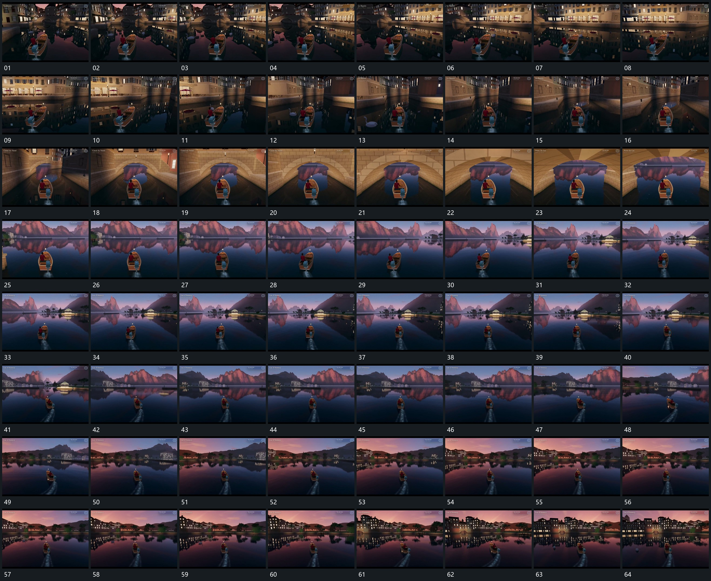

# 105 · 运动过程总览

## 运动总览

全片围同一移动主组，[从后方跟随主组沿弯道改变方向并逐步退远](mechanisms/m01.md)持续从后方跟随并沿弯道改变方向。经过窄范围时[对准开口穿过近侧遮挡后露出宽空间](mechanisms/m02.md)对准开口，先进入遮挡范围再露出更宽空间。进入开阔范围后继续复用[从后方跟随主组沿弯道改变方向并逐步退远](mechanisms/m01.md)，取景逐步后退并转向侧后方。

主组身后[移动主组身后留下短带转向时尾带弯曲](mechanisms/m03.md)留下连续短带，路线转向时尾带随之弯曲并逐步退弱。后半段重复沿弯道跟随，最终回到开口附近，全部运动保持同一主体来源。

## 完整64宫格

按从左至右、从上至下阅读，覆盖全片首尾。具体运动分镜见各子机制。

## 原片与观察范围

[观看参考视频](video.mp4) · [原始来源](https://skillry.dev/ai-videos/opus-5-5/techartist-786274)

依据真实源帧总览及必要局部序列整理，仅描述可见运动、相对布局与接续。抽帧观察不等于原速连续观看或声音核验；不推定精确曲线、隐藏结构、作者源码或原始生成指令。迁移到新片仍需实现和预览。
