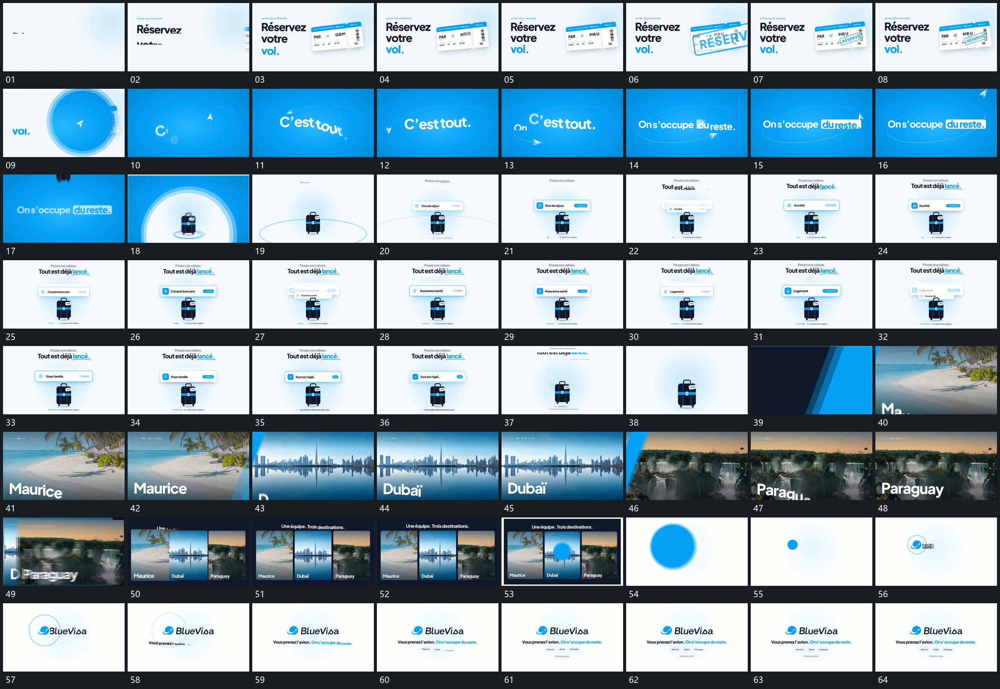

# 015 · 运动过程总览

## 运动总览

开头主字分行建立，[侧方片面倾斜入位，内部轮换后标记叠入](mechanisms/m01.md) 从侧方接入倾斜片面，内部短字快速轮换，倾斜标记随后叠入。圆形层扩大后进入新底，[字沿弧线接续入位，小形绕行后退出](mechanisms/m02.md) 让字沿弧形路径接续入位，前景小形绕行并离开。

随后 [中心体落入，下方点列累计而上卡接续更换](mechanisms/m03.md) 从上方落下中心体，上方短卡依次替换，完成状态留在卡内，下方点列累计。主组退出后 [斜向带经过，后缘揭出下一全幅与字组](mechanisms/m04.md) 用斜向带连续接替多个全幅，字组从下方接上。

后段 [全幅收成并列竖片，圆层接管后缩为锚点](mechanisms/m05.md) 将全幅收成并列竖片，集合保持后圆形层覆盖、缩为小点，再补标记和短行。重复短卡轮换只保留一条指令。

## 完整64宫格

按从左至右、从上至下阅读，覆盖全片首尾。具体运动分镜见各子机制。

## 原片与观察范围

[观看参考视频](video.mp4) · [原始来源](https://skillry.dev/ai-videos/opus-5-5/thismacapital-375808)

依据真实源帧总览及必要局部序列整理，仅描述可见运动、相对布局与接续。抽帧观察不等于原速连续观看或声音核验；不推定精确曲线、隐藏结构、作者源码或原始生成指令。迁移到新片仍需实现和预览。
