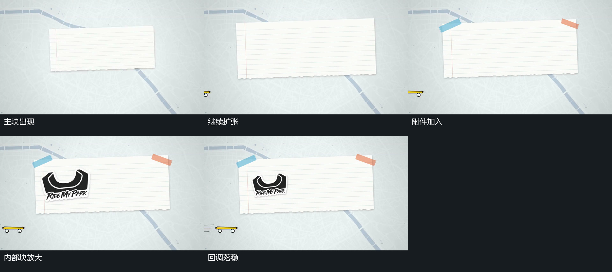

# 矩形扩张越过停留尺寸，再回调落稳

## 运动指令

让背景保持，令主矩形从较小尺寸扩大，同时允许很小的角度或位置变化。让它先越过最终停留尺寸，再缩回并逐渐减少变化幅度。当主块接近落稳时，让上沿小片和内部小块按次序加入，各自重复一次扩大、缩回。让已存在的底部细长小物保持横向通过，不必等主块完全停住才移动。随后保持主块的停留位置，只留下小幅浮动，把后续动作交给块内线条或外围小元素。

## 分镜过程

## 组合与调整

可调整越过停留尺寸的幅度、主块与附件之间的错开量，以及持续横移小物的通过范围。若下一步需要在主块内描画，让主块的尺度先接近稳定；若下一步是遮挡换场，可在小物通过后启动遮挡。不要为了复用这组可见回调而指定未知的原始曲线。

