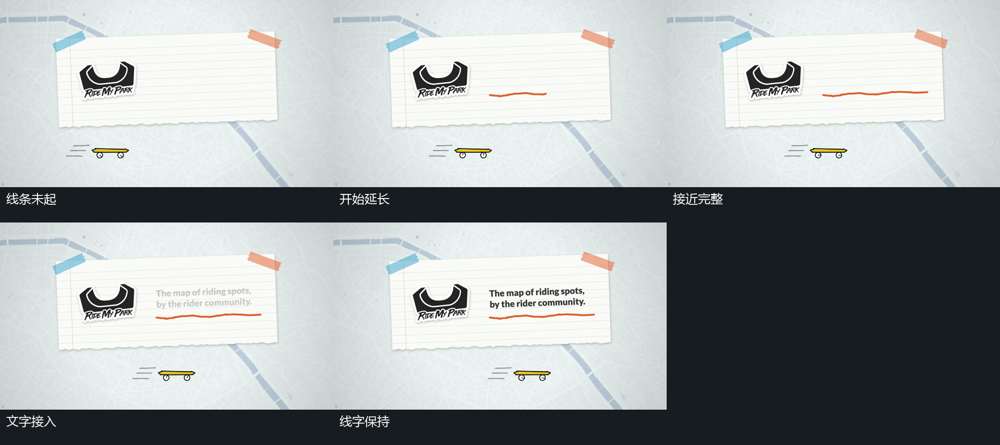

# 横线延长，固定文字随后显出

## 运动指令

让外部矩形和字组预定位置保持，令横线从左端向右延长。当线条接近完整时，让上方字组从淡到清楚，字组不随横线末端移动。随后让横线和字组同时保持，外围元素可以在这个保持阶段加入。让背景及外框不参与这次长度变化。

## 分镜过程

## 组合与调整

可调整线条的起始端、增长方向、最终长度以及字组接入相对线条完成的先后。接续条件是线和字已能稳定停留；后续可以增加点组或用前景遮挡离开。

