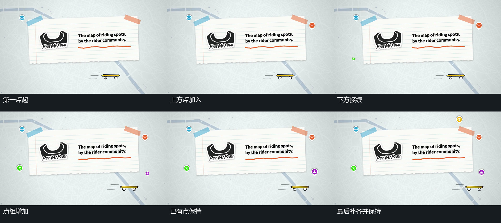

# 小点依路径逐项建立，已出现的点保持

## 运动指令

让承载矩形保持，按预定空间次序让小点逐项出现。让每个点由小变大，再略微缩回到停留尺寸；当较早的点还在回调时，允许下一点开始建立。让已落稳的点保留位置，随后从集合中未完成的位置继续补入。完成后保持整组，不额外让点组沿路径旋转。路径可以是围绕矩形的分散位置，也可以改为上方弧线；后者应从弧线一端持续补到另一端。

## 分镜过程

## 组合与调整

可调整点数、路径形状、出现方向、错开量以及单点的尺寸回调。弧线版本保留“旧点留住、新点接到末端”的关系。若并行展示小片内字符更换，让字符独立变化，不把每个新点与字符变化强行一一绑定。

