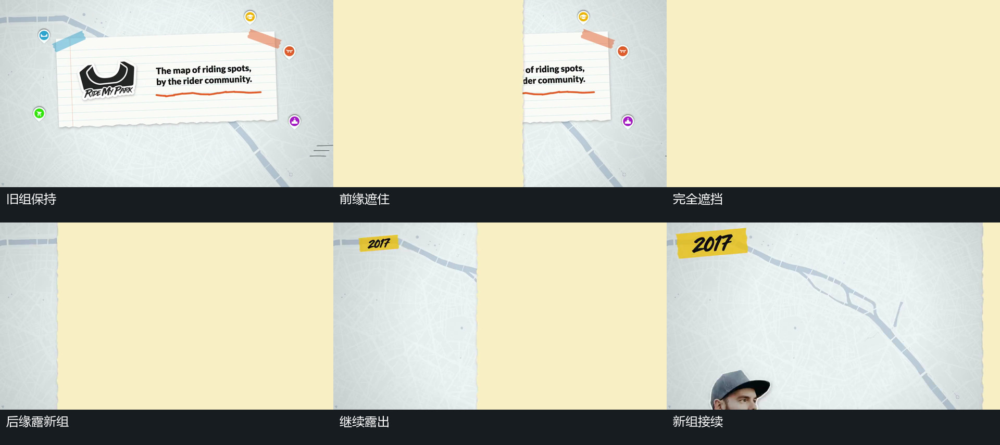

# 宽片横向通过，在全遮挡时更换底层

## 运动指令

让旧组保持，令宽片从左边进入，前缘持续向右推进。让片的覆盖范围足以遮住整幅画面；当画面完全被遮住时，更换其后面的底层内容。随后让宽片继续沿原方向运动，用后缘从左侧开始露出下一组，直至片离开右边。下一组可在遮挡将退时已建立，或在露出期间启动自己的上移、扩张与描画。保持宽片的通过方向连续，不让旧元素同时被要求变形成新元素。

## 分镜过程

## 组合与调整

可调整通过方向、片宽、全遮挡保持长度，以及新组开始动作与露出之间的交叠。若片宽不足以全遮住，必须明确如何处理未遮住的位置；不能直接把局部露出的旧组替换掉。原片反复采用这一关系，总览可多次引用本卡。

