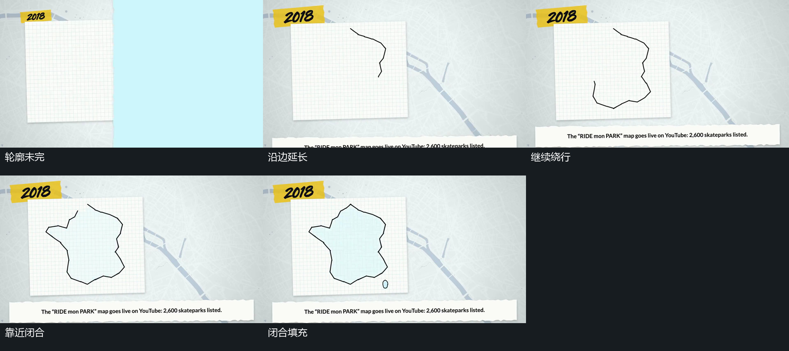

# 轮廓沿边延长闭合，内部填充接入

## 运动指令

让承载片保持，令线条从轮廓起点沿右侧向下延长，经过下部再接左侧，最后回到上部闭合。让线的可见末端沿边连续推进，不让未画出的后半边先完整跳出。当末端接近起点并闭合时，让内部填充接入，随后保持外边界。允许底部横条在轮廓尚未完成时上移落位，与描画交叠。相同关系也可用于竖轮廓或圆形边界，沿边次序应随实际路径调整。

## 分镜过程

## 组合与调整

可调整起点、行进方向、轮廓形状以及填充相对闭合的交叠程度。后续逐点增补必须以边界已能定位为条件；内部块面要移动时，让外边界先保持稳定。

