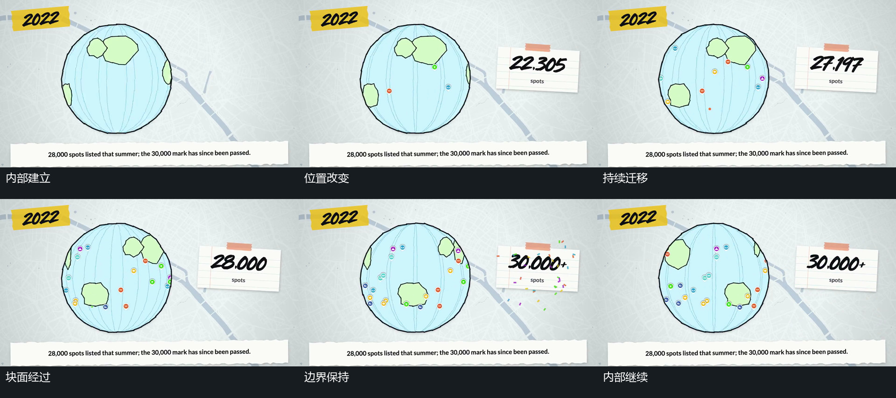

# 圆形外边界保持，内部块面持续横向迁移

## 运动指令

让圆形外轮廓保持尺度，令内部块面和曲线持续改变横向位置。让块面从一侧经过可见区域，在另一侧逐步离开或由新的内部形状接续；让小点留在对应内部内容上共同经过。圆体可以有很小的上下浮动，但不把内部迁移扩大为整幅画面的旋转或推进。随后保持外轮廓，把其他动作交给旁边的矩形或散出的碎片。

## 分镜过程

## 组合与调整

可调整内部内容的方向、位移幅度、重复方式，以及小点是否随内部内容共同移动。保留外边界稳定这一约束；接续时可先停止内部变化，也可让遮挡直接接管整组。

