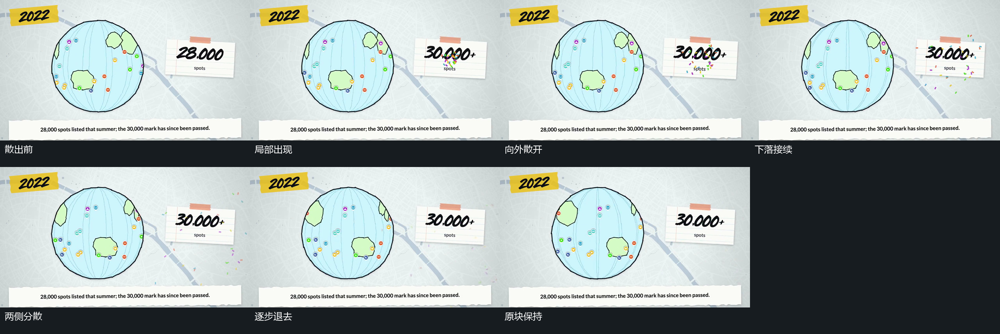

# 碎片从局部散出，再向下分散退出

## 运动指令

让已有圆形和矩形保持，令小碎片从矩形附近的局部位置出现并向外散开。随后让碎片一边下落，一边向两侧继续分散，较早的碎片可先离开，后面的碎片仍在下降。让原来的圆内运动保持，不为碎片散出暂停整组。最后让碎片大多退出，只保留原有块及其小幅浮动。

## 分镜过程

## 组合与调整

可调整散出范围、数量、离开方向及碎片可见时长。把散出与后续下降连续接起来；接续下一组时，可在碎片退去后等待，也可由遮挡提前接管。

