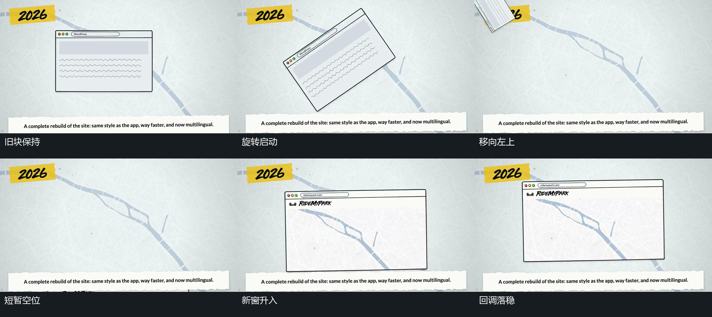

# 旧矩形旋转抛出，新窗口从下方接入

## 运动指令

让底层和周边条片保持，令旧矩形开始逆时针旋转。让它在角度快速变化的同时向左上移动，直至整块越过画面边界；不要先旋转完毕再开始位移。随后允许中央短暂露出底层，让独立新矩形从右下方升入，来到停留位置附近后再小幅向上调整并落稳。当新框接近稳定时，让内部小点与上沿小项错开增加，最后保持新窗口。

## 分镜过程

## 组合与调整

可调整旋转方向、离开边界、空位长度及新块来路。若必须无空位接续，可提前让新块进入，但仍保持它与旧块是两个独立对象；不把可见退出关系写成旧矩形折成新框。

