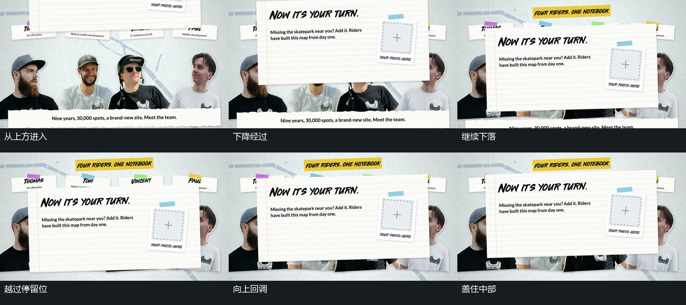

# 前景片下降越过停留位置，再向上回调

## 运动指令

让已有图块集合保持，令大矩形从上边降入。让它经过上中部后继续下降，略越过最终停留位置，再向上回调；越接近停留状态，位置变化越小。让矩形在既有集合前方盖住中部，同时保留外围和底边可见的裁切部分。随后保持前景片，把后续动作交给它的内部小条和小点，底图不跟随下降。

## 分镜过程

## 组合与调整

可调整进入边、过位幅度、覆盖范围和回调幅度。接续内部动作时，让前景位置先趋稳；若底层需要同时变化，应另行明确，不能由这一前景运动推定整场运动。

