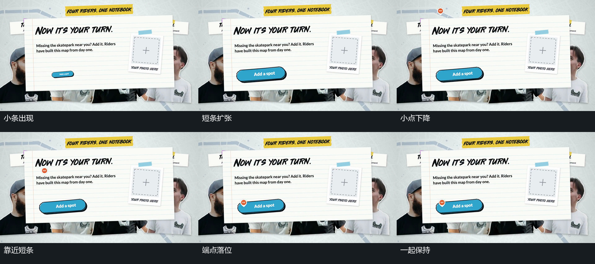

# 小条扩张落稳，小点随后下降停在端点

## 运动指令

让前景片保持，令左下胶囊短条从小尺寸扩大，略越过停留尺寸后缩回。当胶囊已接近稳定时，让上方小点向下运动，经过片内其他固定内容，最后落到胶囊左端并停留。让胶囊不追随下落小点移动，落位完成后保持两者。随后可让片外下方另一短条以同样的扩大缩回方式接入。

## 分镜过程

## 组合与调整

可调整小点起点、下降距离、落在短条的哪一端，以及胶囊回调与小点启动之间的交叠。必须先建立可定位的短条，再让小点完成落位；后续保持或退出应把两者的关系一起保留。

