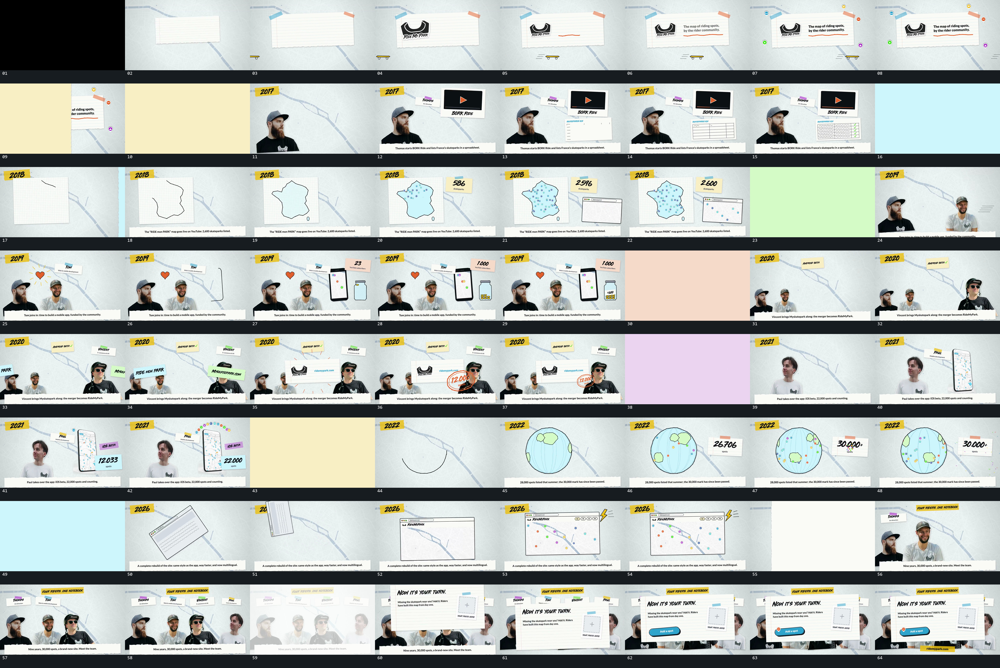

# 002｜原片运动总览

[观看完整原片](video.mp4)

开场让横向矩形从小尺寸扩大并回调，两个上沿小片与内部小块错开接入；底部细长小物同时从左向右持续通过。主块接近稳定后，内部横线延长，固定字组随后显出；外围小点按空间次序逐项建立，已有点留在原位。这里依次连接[矩形扩张回调](mechanisms/m01.md)、[横线与固定文字接力](mechanisms/m02.md)、[小点逐项建立](mechanisms/m03.md)。

随后让[宽片横向遮挡换场](mechanisms/m04.md)。宽片前缘遮住旧组，在全遮挡时更换底层，再由后缘露出下一组。新组左下裁切块上升扩大并回调，底部横条同时上移；上方条片、右上矩形与右下矩形错开进入，沿用[扩张回调](mechanisms/m01.md)的关系。右上内部横线继续增长，右下空块接[先画网格再逐行填入](mechanisms/m05.md)，其他块保留位置与轻微浮动。

下一次仍由[宽片遮挡](mechanisms/m04.md)接管。退去后方片内折线沿边延长并闭合，内部块面在闭合时接入，底部横条提前上移，与[轮廓闭合填充](mechanisms/m06.md)交叠。右上小片扩张入位并离散更换内部字符；方片内小点逐项增加，第二矩形从右下斜入回调后继续补点，沿用[逐项增补并保持](mechanisms/m03.md)。字符更换与补点并行，不要求一一对应。

再次[遮挡换场](mechanisms/m04.md)后，左下旧裁切块保持，右侧新裁切块快速靠近并减速，接[侧入并置](mechanisms/m07.md)；底部横条同时上升。上方小形状和短片分次扩张，小形状外围短线显出后减淡。右侧竖轮廓随后按[沿边闭合](mechanisms/m06.md)建立，旁边容器和上方字符片接入。容器内接[小椭圆下落累积](mechanisms/m08.md)：空中旧项尚未落稳，新项就进入，更早项留在底部。字符片同时更换，待最后一项落稳后整组浮动保持。

再一次[宽片遮挡](mechanisms/m04.md)露出下一组：左下两块、上方条片与底部横条错开建立，右侧裁切块扩大过位再缩回。随后两条长片从相反边界进入并重叠，分开到内侧后又靠拢退去，交给中央新矩形扩张回调，右下圈线再以较大尺寸出现并缩回；这一整段使用[双条相向与新块接力](mechanisms/m09.md)。完成后底层与新前景一起小幅浮动保持。

接着用[宽片遮挡](mechanisms/m04.md)更换底层。左侧裁切块横向进入时先快后慢，底部横条上移；右侧竖窗从下方升入、略超过停留位置后回落。上方短片、右侧短片错开扩张，竖窗上方小圆点沿弧线逐项补齐，使用[沿路径逐项建立](mechanisms/m03.md)的弧线版本。字符片在补点过程中持续更换，完成后竖窗、弧线、条片与左侧图块保持浮动。

下一次[遮挡换场](mechanisms/m04.md)后，中央圆线沿边闭合，内部曲线与块面接入，仍使用[轮廓闭合填充](mechanisms/m06.md)。底部横条提前上升，右矩形扩张回调，小点和字符分次增加。圆形外边界保持尺度，内部块面持续改变横向位置，接[圆内迁移](mechanisms/m10.md)。右矩形内字符先停留、再更换并增加附加符号，同时局部小碎片[向外散出再下降退出](mechanisms/m11.md)；碎片退出时圆内运动仍继续。

随后[宽片遮挡](mechanisms/m04.md)露出中央旧矩形，上方条片内字符更换，底部横条上升。旧矩形边逆时针旋转边向左上抛出，中央短暂露出底层；新窗口从右下升入并回调落稳，接[旋转抛出与新窗接替](mechanisms/m12.md)。新窗内部小点与右上小项交叠增加，外围折角形扩大再缩回，之后整组保持。

再次[宽片遮挡](mechanisms/m04.md)露出上方长条，横向裁切块从左到右逐项累积，配套短条错开进入。每一块的扩大回调还未完全结束，下一组便开始，接[横排累积与附件接力](mechanisms/m13.md)。整排稳定后发生一次全组减淡与恢复，恢复的是原位置的同一集合，随后继续保持。

最后让[前景片下降过位再向上回调](mechanisms/m14.md)，在完整横排前方盖住中部，外围和底部裁切边仍可见。前景落稳后，片内胶囊扩大缩回，上方小点下降并停在其左端，接[小条建立与小点端点落位](mechanisms/m15.md)。下方另一短条继续扩大回调，胶囊旁再增加一个小尖形符号。此后所有片保持小幅上下浮动，原片没有继续退场。

这些卡片把已经观察到的动作关系转成可调整的运动指令；具体曲线与原始实现未知，使用时以进入、交叠、回调、保持及接续条件为约束。

