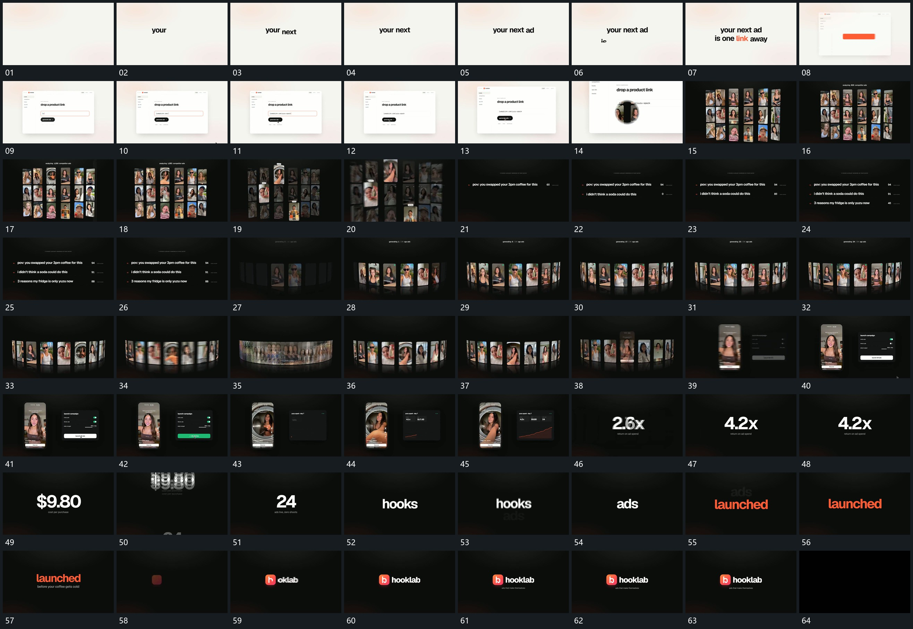

# 003 · 运动过程总览

## 运动总览

开头 [文字逐词补入，完成后保持整组](mechanisms/m01.md) 逐词建立两行字组，随后固定窗口与输入行接入。[窗口推近退出，图块集合接管](mechanisms/m02.md) 从输入状态推向图块集合，集合先留场，再 [集合中少量片突出，其余退淡后共同离场](mechanisms/m03.md) 突出少量前景片并退去整组。

中间按行建立短句与数字，复用 [文字逐词补入，完成后保持整组](mechanisms/m01.md) 的逐项累积。接着 [弧形竖片逐项补齐，加速横移后停清](mechanisms/m04.md) 沿弧形排列补齐竖片，加快横向轮换后停清；[选中竖片向前接管，旁侧面板补入](mechanisms/m05.md) 从集合中提起一片，周边退淡，新旁侧面板接入。框内持续变化时，[数字与折线在固定面板内逐步增长](mechanisms/m06.md) 让旁侧计数与折线逐步增长。最后 [大字沿竖向轮换，末组收成短行](mechanisms/m07.md) 在同一位置轮换大字，再建立小标记、短行和附属字收尾。

## 完整64宫格

按从左至右、从上至下阅读，覆盖全片首尾。具体运动分镜见各子机制。

## 原片与观察范围

[观看参考视频](video.mp4) · [原始来源](https://skillry.dev/ai-videos/opus-5-5/twoclipping-000267)

依据真实源帧总览及必要局部序列整理，仅描述可见运动、相对布局与接续。抽帧观察不等于原速连续观看或声音核验；不推定精确曲线、隐藏结构、作者源码或原始生成指令。迁移到新片仍需实现和预览。
