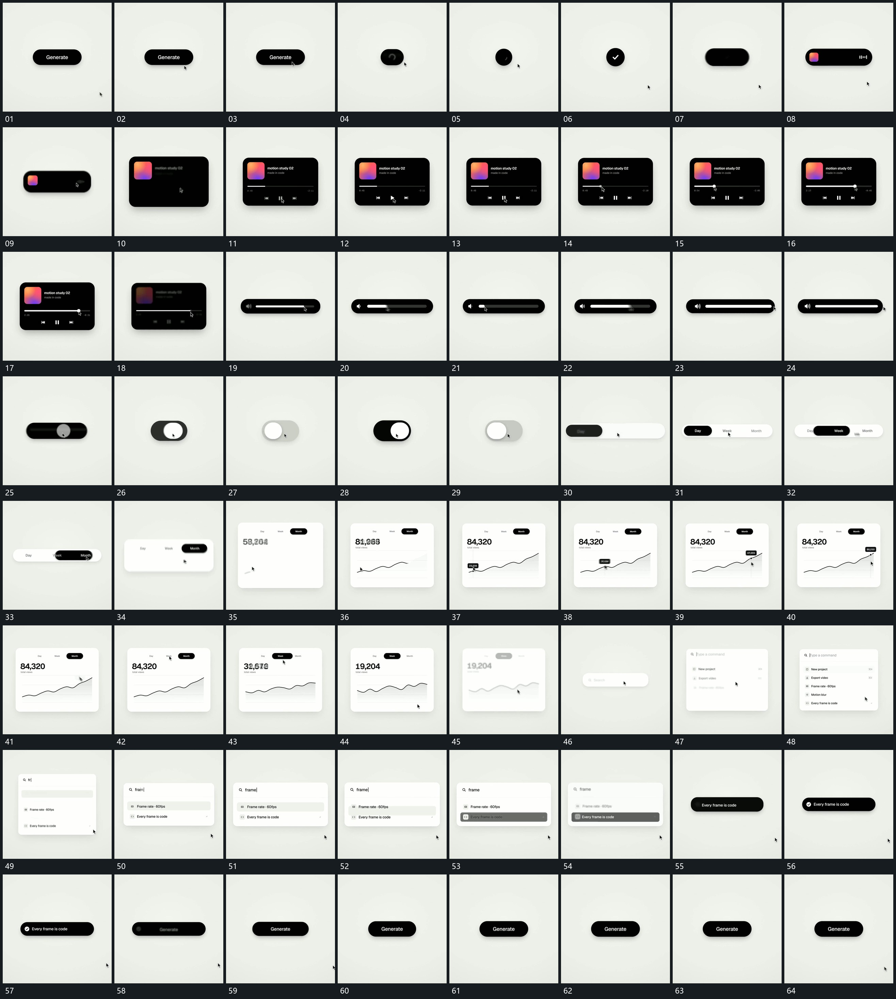

# 109 · 运动过程总览

## 运动总览

全片以[宽条收成圆区再伸展并向下打开宽框](mechanisms/m01.md)让宽条收成圆区，再横向伸展并向下展开成宽框。框内[长线端点沿线移动经过范围留下填充](mechanisms/m02.md)沿长线移动端点，经过范围留下填充；随后[宽框压低收成细条原长线仍保留](mechanisms/m03.md)压低框高，收成细条并保留原线。

细条进一步收短后[短区内圆左右滑动再把外区横向展开](mechanisms/m04.md)让内圆左右滑动，再展开为多区长条。长条向下展开时[框内曲线逐段描出小点沿线经过并带动短标](mechanisms/m05.md)描出曲线并让小点沿线经过。末段[列表逐项减少外框随内容收小最后回成短条](mechanisms/m06.md)逐项减去列表、随结果收小外框，再将外框收成短条，回到初始宽条状态。

## 完整64宫格

按从左至右、从上至下阅读，覆盖全片首尾。具体运动分镜见各子机制。

## 原片与观察范围

[观看参考视频](video.mp4) · [原始来源](https://skillry.dev/ai-videos/opus-5-5/twoclipping-402193)

依据真实源帧总览及必要局部序列整理，仅描述可见运动、相对布局与接续。抽帧观察不等于原速连续观看或声音核验；不推定精确曲线、隐藏结构、作者源码或原始生成指令。迁移到新片仍需实现和预览。
