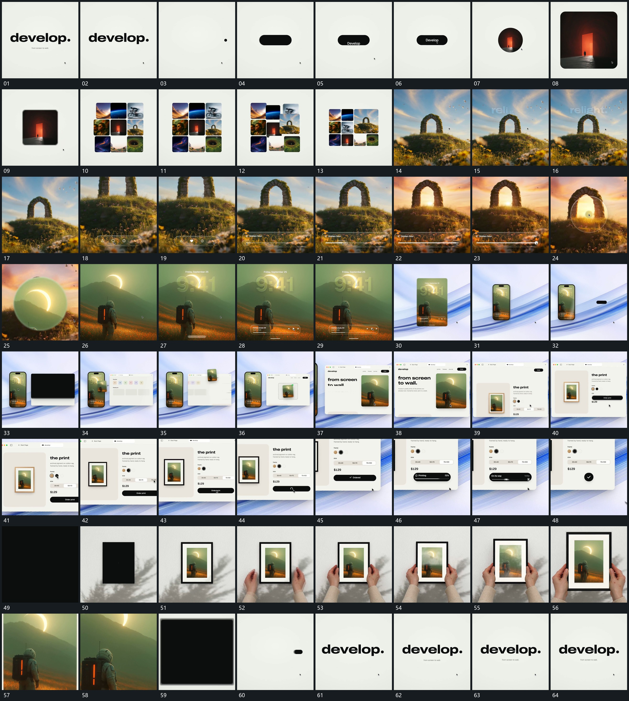

# 011 · 运动过程总览

## 运动总览

开头大字退出，[小点伸成长条，圆口显图后扩大成片](mechanisms/m01.md) 让小点伸成长条，再借圆形可见区域接入新图，扩大成矩形片。[网格围绕原片补齐，选中格扩大接管全幅](mechanisms/m02.md) 围绕该片补成网格，突出其中一格并由其画面接管全幅。

全幅上 [指示形沿底部长条推进，内部状态连续改变](mechanisms/m03.md) 保持图像参照，指示形沿横条推进，内部状态连续更换。随后 [局部圆口露出新层，放大后接管原场](mechanisms/m04.md) 在局部打开圆形新层，扩大后接入下一全幅。新场中的大数字与下方短条建立，[全幅收成竖片，旁侧大框接力建立](mechanisms/m05.md) 把满幅收成竖片并接入旁侧大框。

中段 [小片从竖框附近提起，跨到旁框目标空位](mechanisms/m06.md) 从竖片附近提起小片，跨到旁框的目标空位，再由大框推近接管。框内继续复用局部选项更新，[长条内部更新进度，最后收成圆形完成标记](mechanisms/m07.md) 让长条更换状态、增加进度并收成圆形完成标记。后段 [同形框匹配到新底层，侧边前景接住后推近](mechanisms/m08.md) 让同形框在新底层建立，靠近的前景从两侧接住框边，整体推近后回到长条与大字收尾。

## 完整64宫格

按从左至右、从上至下阅读，覆盖全片首尾。具体运动分镜见各子机制。

## 原片与观察范围

[观看参考视频](video.mp4) · [原始来源](https://skillry.dev/ai-videos/opus-5-5/twoclipping-496100)

依据真实源帧总览及必要局部序列整理，仅描述可见运动、相对布局与接续。抽帧观察不等于原速连续观看或声音核验；不推定精确曲线、隐藏结构、作者源码或原始生成指令。迁移到新片仍需实现和预览。
