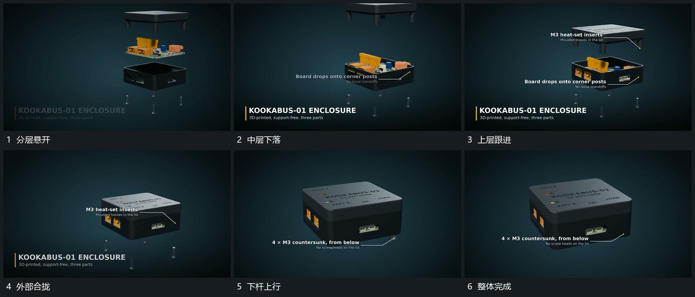

# 同轴分层依次合拢，末端小杆反向补入

## 运动指令

先沿同一竖轴保留分开的层次，底层作为固定参照。让中层向下进入底层，再让上层跟着下降并覆盖中层；外部合拢后，底部细小杆件向上移动补入，完成整组。各层按空间关系接力，已归位的层不随下一层重启。

## 分镜过程

## 组合与调整

可改变层数与间距，保持先后遮挡及共同轴线。不要把每层同时压在一起，否则无法看清归位关系。后续外侧连接从完整组继续。
