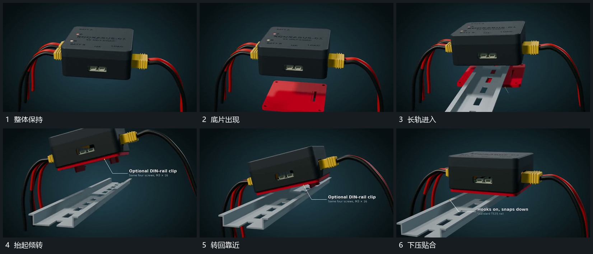

# 下方新片接入，整组抬起倾转后下压贴合长轨

## 运动指令

先退去上一组标注，让下方新片进入，中央整组抬起并倾转，为底片和斜向长轨让出空间。底片靠近下表面，长轨从下方斜入；整组随后转回、向轨靠近，再下压贴合。两侧已经连接的线形随整个组的位置改变，不能留在画面旧坐标。

## 分镜过程

## 组合与调整

可调整倾角和进入方向，保留抬起让位、对齐、落下的顺序。源帧支持可见贴合，不足以推断内部机械约束或真实受力。
