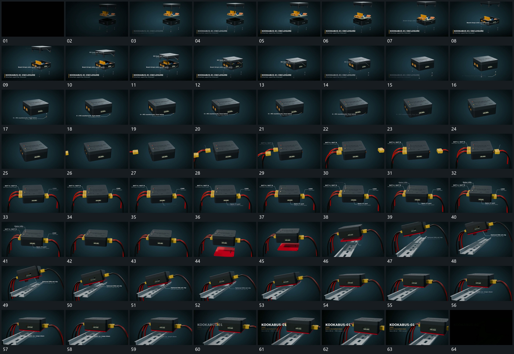

# 106 · 运动过程总览

## 运动总览

开头显出沿竖向分开的层次与下方字组。[同轴分层依次合拢，末端小杆反向补入](mechanisms/m01.md) 让中层、上层依次向下合拢，底部小杆再反向向上补齐；局部说明随归位阶段出现。

整组稳定后 [左右端块先后靠近插入，尾部线形跟随](mechanisms/m02.md) 从左侧、右侧先后接入端块，尾部线形跟随。随后 [折线标注围绕稳定对象逐个展开](mechanisms/m03.md) 沿侧面、下方、顶部逐项建立折线标注，已出现部分保留。

标注退去，[下方新片接入，整组抬起倾转后下压贴合长轨](mechanisms/m04.md) 让下方新片与长轨进入，整组抬起倾转、回转靠近，最后下压贴合。已经连接的线形跟随整组移动。尾部 [完整组向侧边让位，旁侧文字接入后减淡](mechanisms/m05.md) 将完整结构让到一侧，另一侧字组接入，最后整体减淡。

## 完整64宫格

按从左至右、从上至下阅读，覆盖开头到结尾；用于查看全片发展，具体机制已在各自文档中配分镜。

## 原片与观察范围

[观看参考视频](video.mp4) · [原始来源](https://skillry.dev/ai-videos/opus-5-5/vectorcrossprod-436573)

本次依据真实源帧的完整总览、密集序列及必要局部补帧整理，仅记录可见运动与接续。抽帧观察不等于原速连续观看或声音核验；不据此指定精确曲线、隐藏结构、作者源码或原始生成指令。机制可迁移，具体实现仍需在新片中预览检验。
