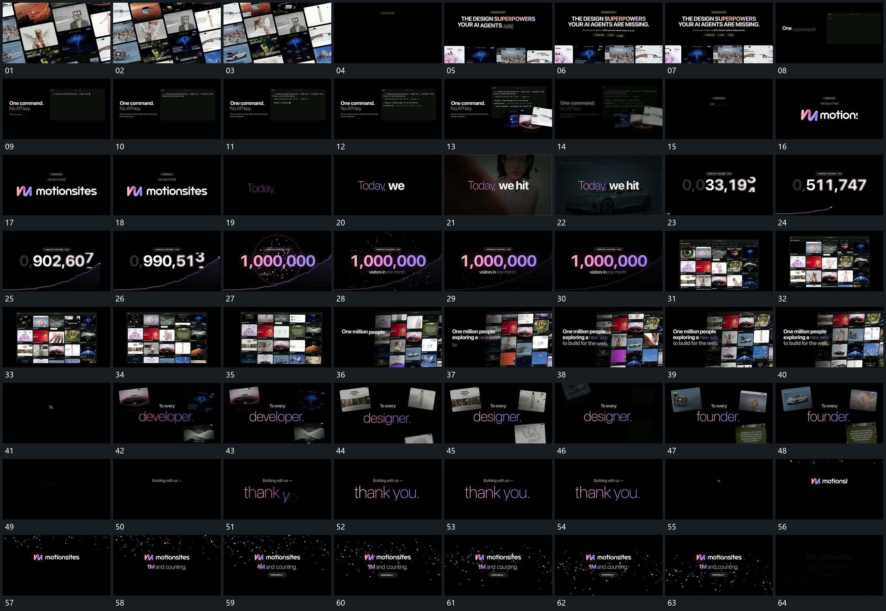

# 022 · 运动过程总览

## 运动总览

开头 [倾斜多排集合流动后向下退让，中心字接上](mechanisms/m01.md) 让多排倾斜图块横向流动，集合退到下方后中心字组建立。[固定框内逐字输入，后行接续补齐](mechanisms/m02.md) 保留局部框边，逐字输入，再逐行补入后续文字，几张小片在框前接入。

中段文字逐项建立，活动底层切换后退去，[数字逐位滚动到结果，折线增长后小片扩散](mechanisms/m03.md) 中央数字逐位滚动增长，下方折线延长，到结果时散片从中心扩出。随后回到满幅集合，[流动集合退弱，前景文字与少量片轮换](mechanisms/m04.md) 让集合横移退弱，前方文字保持；之后只留少量外围片，中心词组继续轮换。

收尾先建立中心短句，[中心字稳定，周围散片向外扩出再下落](mechanisms/m05.md) 从周边散出小片，标记与附属行稳定，小片下落退出后整组减淡。

## 完整64宫格

按从左至右、从上至下阅读，覆盖全片首尾。具体运动分镜见各子机制。

## 原片与观察范围

[观看参考视频](video.mp4) · [原始来源](https://skillry.dev/ai-videos/opus-5-5/viktoroddy-402509)

依据真实源帧总览及必要局部序列整理，仅描述可见运动、相对布局与接续。抽帧观察不等于原速连续观看或声音核验；不推定精确曲线、隐藏结构、作者源码或原始生成指令。迁移到新片仍需实现和预览。
