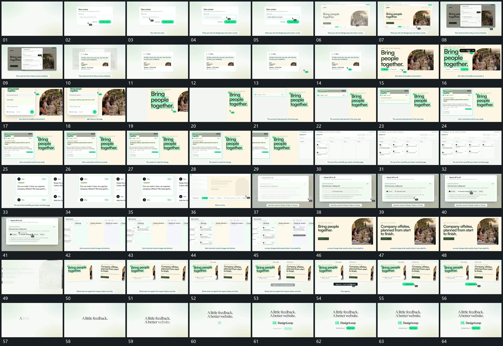

# 019 · 运动过程总览

## 运动总览

开头固定窗口内输入，指示符移动到末端后主框接入。[后层退弱，前方浮窗建立后收回](mechanisms/m01.md) 让后层退弱、前方浮窗出现，更新后收回；新卡片接入并保留。接着 [局部字组被框住，侧片推出后逐字补入](mechanisms/m02.md) 对局部字组建立范围强调，再向侧方推出编辑片。

中段 [定位点留在原处，旁卡分层增长](mechanisms/m03.md) 从原位置建立定位点，旁侧浮卡由简到繁增长，保留原图与文字。之后 [小卡分列填入，部分项在列间移动](mechanisms/m04.md) 将多个小卡填入分列布局，再在列间移动、留下新状态。局部浮窗反复接入时复用第一机制。

后段返回原框、更新局部文字，再 [主框收为并置小片，前后状态分别留住](mechanisms/m05.md) 收成并置小片供对照，前后片保持不同内部状态，底部确认形接上。最后中心短句逐词建立，标记和长条补齐。

## 完整64宫格

按从左至右、从上至下阅读，覆盖全片首尾。具体运动分镜见各子机制。

## 原片与观察范围

[观看参考视频](video.mp4) · [原始来源](https://skillry.dev/ai-videos/opus-5-5/vince-builds-355650)

依据真实源帧总览及必要局部序列整理，仅描述可见运动、相对布局与接续。抽帧观察不等于原速连续观看或声音核验；不推定精确曲线、隐藏结构、作者源码或原始生成指令。迁移到新片仍需实现和预览。
