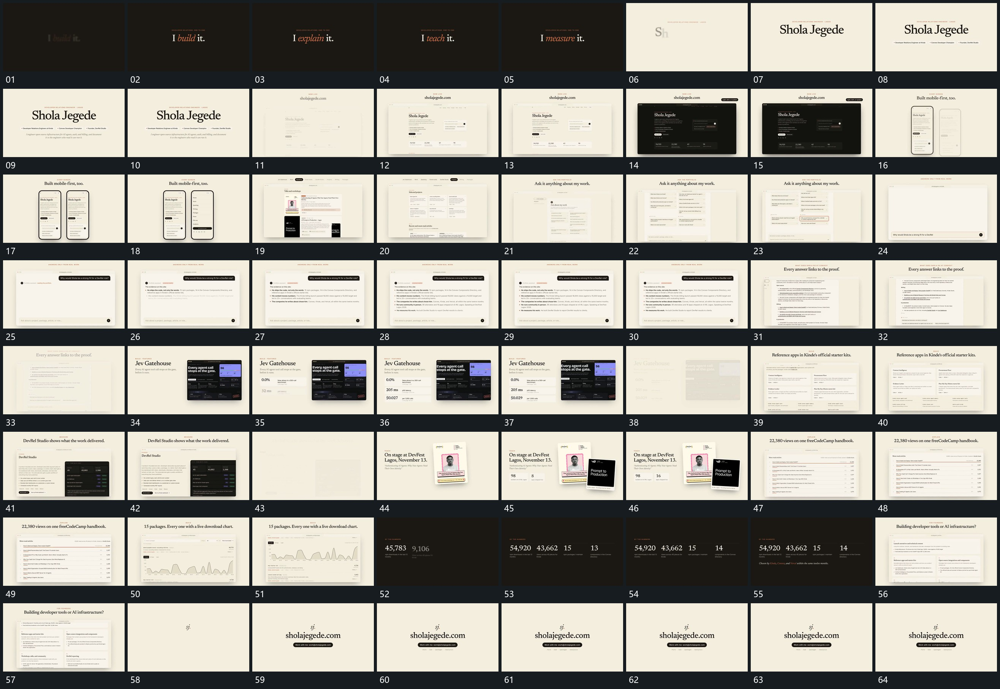

# 034 · 运动过程总览

## 运动总览

全片以固定框和字组为持续承载。开头 [中央短句原位轮换，局部由模糊变清楚](mechanisms/m01.md) 轮换中央短句并让局部由模糊变清楚；随后 [固定框内轮换内容，外框与标题保持](mechanisms/m02.md) 建立大框，内部布局轮换，外部标题保持。[两竖框错峰并置，一框内侧边列表展开](mechanisms/m03.md) 依次接入并置竖框，再在其中一个框内展开侧边列表。

中段 [上方气泡接到逐行正文，框内上滚继续补行](mechanisms/m04.md) 从上方气泡接续到逐行正文，后续在固定框内上滚补入更多行。[图框保持，旁侧数值逐行建立并更新](mechanisms/m05.md) 让旁侧数值从少到多建立并持续更新，图框保持；[倾斜前片先进入，后片从侧下补入叠层](mechanisms/m06.md) 将带倾角的片面分层接入，已有片保留。后段又使用 [固定框内轮换内容，外框与标题保持](mechanisms/m02.md) 更新大框内容，长内容在固定框内上滚，已有曲线区域随之移入可见区，不是曲线从空开始描出。末段 [多列数值错开建立，依次增加后共同落稳](mechanisms/m07.md) 错开建立多列数值并增加到稳定结果，再换框、退净，建立最终短字与长条保持。

## 完整64宫格

按从左至右、从上至下阅读，覆盖全片首尾。具体运动分镜见各子机制。

## 原片与观察范围

[观看参考视频](video.mp4) · [原始来源](https://skillry.dev/ai-videos/opus-5-5/wani-shola-459278)

依据真实源帧总览及必要局部序列整理，仅描述可见运动、相对布局与接续。抽帧观察不等于原速连续观看或声音核验；不推定精确曲线、隐藏结构、作者源码或原始生成指令。迁移到新片仍需实现和预览。
