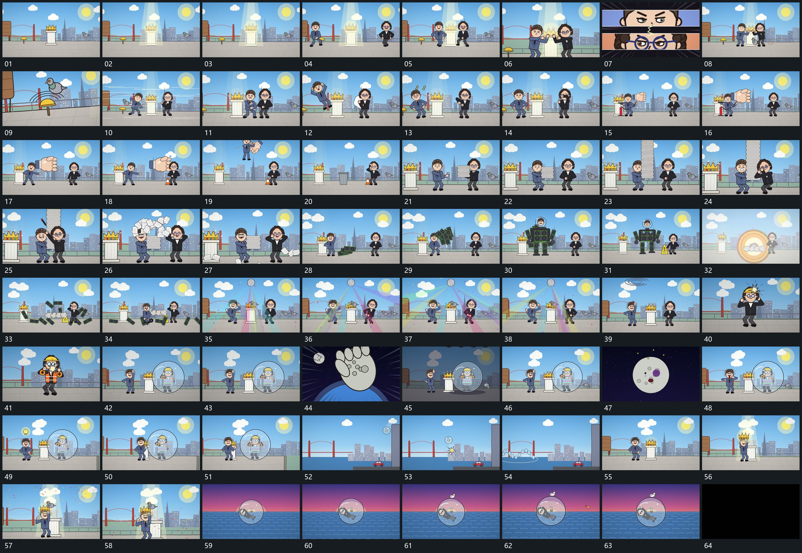

# 070 · 运动过程总览

## 运动总览

开头固定空间内两组形从侧边进入，局部接近后 [两条窄横片并置局部近景，短线隔开后回到全貌](mechanisms/m01.md) 以两条窄横片并置近景，短线隔开，再回到全貌。[局部长形放大后侧向扫过，原组形让位](mechanisms/m02.md) 让局部长形从较小尺度放大并侧向扫过，组形随后上移或退开。

中段 [横片逐层堆高，到顶后向外散开，保留少量片](mechanisms/m03.md) 将横片逐层堆高，到顶后向外散开，保留少量片。[散块围主形聚成外层，再分解落到承载面](mechanisms/m04.md) 让散块聚到主形周围构成外层，再从局部开始分解，散块落到承载面。[圆形边界逐段包住组形，圆壳与内部小幅转动](mechanisms/m05.md) 在主形外逐段补出圆形边界，内部组形随圆壳小幅转动，旁小点经过。

后段 [圆壳沿弧向下落，落点圈扩散后原空间接续](mechanisms/m06.md) 圆壳沿弧向下落，落点圈扩散，原空间接续。主形与附属小片接入，短散片向外经过。末段 [圆壳带内部组沿平面漂移，外围小点持续经过](mechanisms/m07.md) 圆壳与内部组共同沿平面缓慢漂移，圈内局部姿态轻微改变，外围小点经过，最后退暗。

## 完整64宫格

按从左至右、从上至下阅读，覆盖全片首尾。具体运动分镜见各子机制。

## 原片与观察范围

[观看参考视频](video.mp4) · [原始来源](https://skillry.dev/ai-videos/opus-5-5/xanderwow-a-597063)

依据真实源帧总览及必要局部序列整理，仅描述可见运动、相对布局与接续。抽帧观察不等于原速连续观看或声音核验；不推定精确曲线、隐藏结构、作者源码或原始生成指令。迁移到新片仍需实现和预览。
