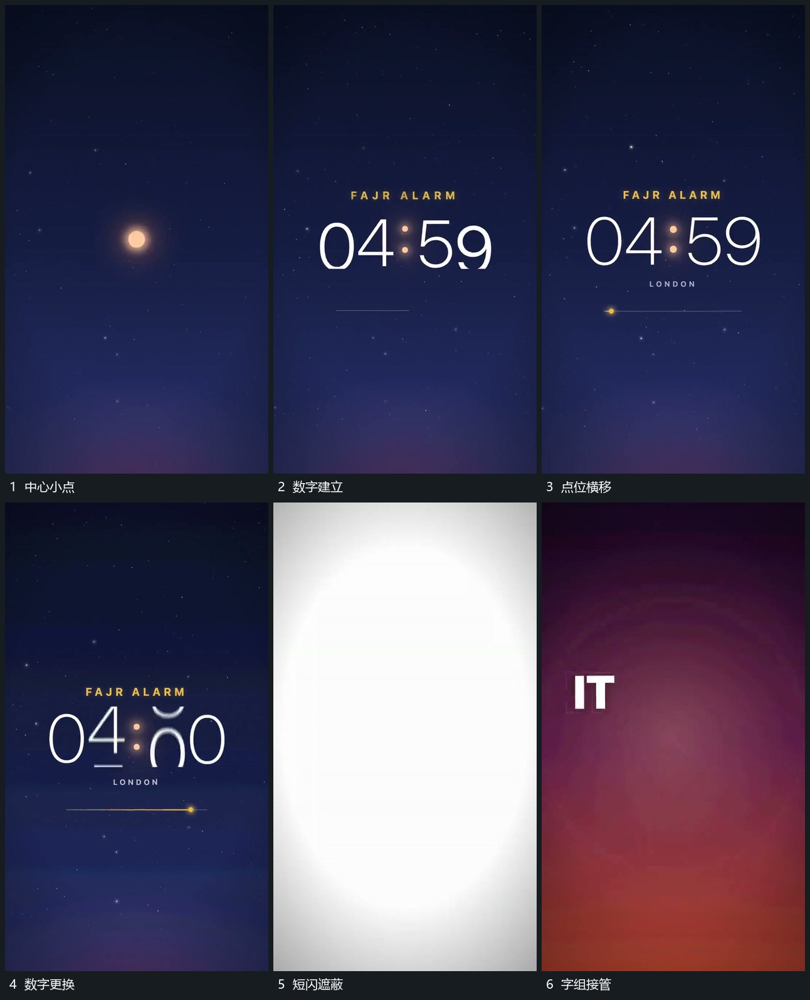

# 数字与横向点位接力，短闪后交给字组

## 运动指令

先让中心小点收小，再建立数字与下方短线。点沿短线横移，数字随阶段更换；随后短闪覆盖画面，数字和点退出，下一字组在闪后接管同一中部区域。数字变化和点位移动构成一组推进提示，不把它们分散到互不对应的位置。

## 分镜过程

## 组合与调整

可改变数字序列和横移距离。下一机制从闪后字组开始，不必保留原数字；闪切只是遮蔽交接，不代表数字变形成了文字。
