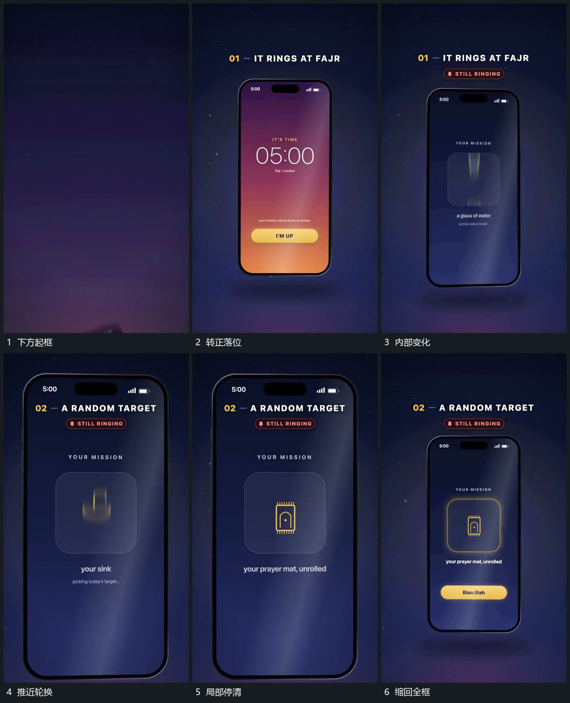

# 竖框上升转正，推近内部轮换后缩回

## 运动指令

让竖框从下方带倾角上升，逐渐转正落位。框内先建立局部提示，随后推近，使中部小图形成为主要可见内容；这些小图形沿竖向模糊轮换，最后一项停清楚。待边界与下方附属条显出后，整框缩回到可以看清外轮廓的尺度。

## 分镜过程

## 组合与调整

局部轮换可换成图片或符号，但需保留停清楚的结果。后续可从框内内容向全屏扩张；不要在推近时换掉外框的位置关系，使返回没有参照。
