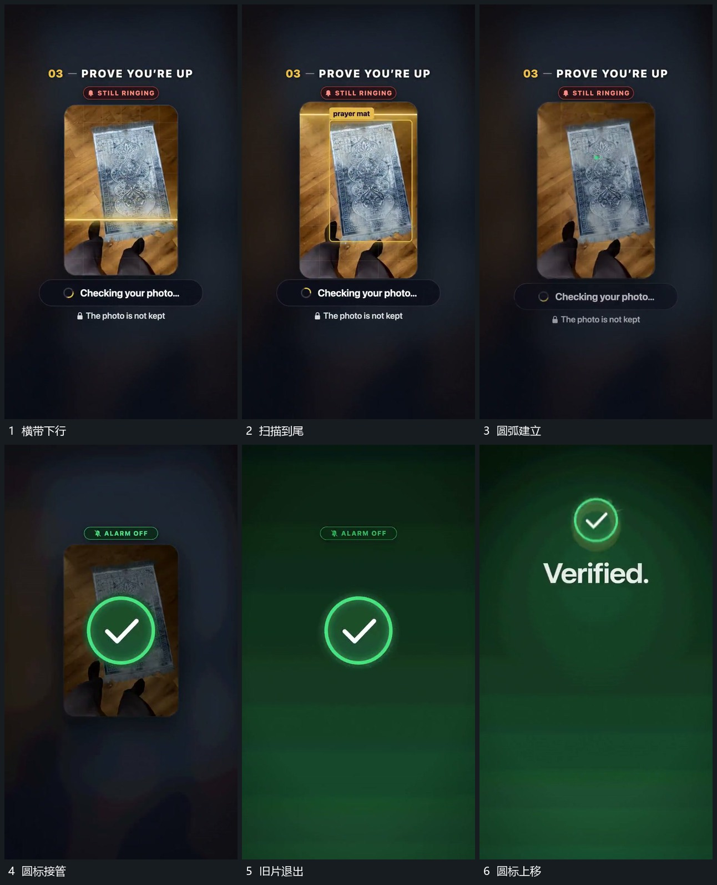

# 横带向下扫描，结果圆标放大接管再上移

## 运动指令

让横带从竖片上方向下经过，已扫过区域留在片内，末端叠入局部边框。随后建立小弧形，再扩成完整结果圆标并放大；旧图像与片面退去，圆标留在新底层。圆标缩小并向上移，为下方新内容腾出位置。

## 分镜过程

## 组合与调整

扫描方向可改，结果标记也可换形，但结果应在扫描推进后出现。圆标的收小上移是下一布局的接点，不另造一个无来源的小标记。
